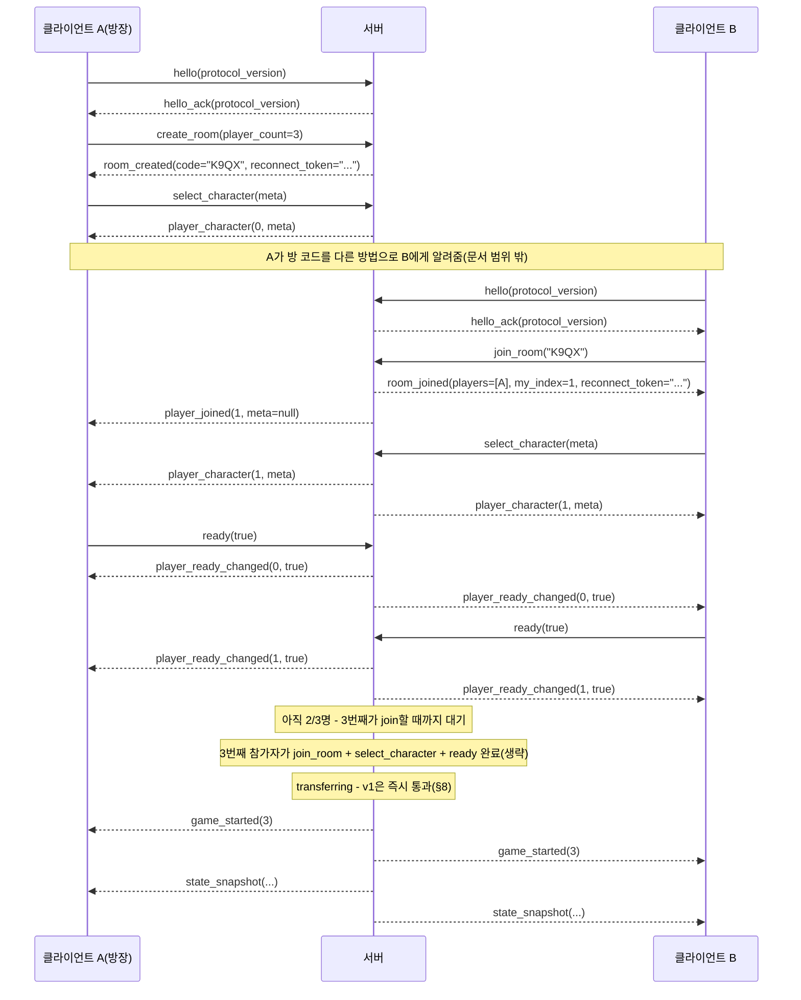

# 온라인 멀티플레이 설계 (Phase 2)

이 문서는 설계만 다룬다. 코드는 아직 한 줄도 없다. 구현을 시작하기 전에
여기 적힌 결정들을 먼저 확정한다.

## 0. 전제

- 웹(HTML5) export를 지원해야 하므로 ENet/UDP는 쓸 수 없다. 전송 계층은
  `WebSocketMultiplayerPeer`(WebSocket, TCP 기반)로 고정한다.
- 웹 빌드는 WebSocket 클라이언트만 될 수 있다. 플레이어가 호스트가 되는
  구조(P2P, 리슨 서버)는 불가능하다 — 별도의 전용 서버 프로세스가 항상 있어야 한다.
- 서버는 이 프로젝트를 headless(dedicated server)로 export한 **같은
  바이너리**로 돌린다. 서버 전용 코드베이스를 따로 두지 않는다.
- 방 인원은 2~4명. 모든 메시지·상태는 처음부터 배열/맵으로 N명을 표현한다.
  "상대 한 명"을 전제로 한 필드(`opponent_score` 같은 것)는 만들지 않는다.
- 게임 규칙의 주인은 서버다. 주사위는 서버의 RNG로만 굴린다. 클라이언트는
  "굴리고 싶다/이 칸에 쓰고 싶다"는 의도만 보내고, 실제 계산과 확정은 서버가 한다.

## 1. 전체 구조

```
                         ┌───────────────────────────────┐
                         │   전용 서버 프로세스 (headless)   │
                         │                                │
                         │  WebSocketMultiplayerPeer(서버)  │
                         │            │                    │
                         │      RoomManager                │
                         │      ├─ Room "AB3F" ─ GameState │
                         │      ├─ Room "K9Q2" ─ GameState │
                         │      └─ Room "..." ─ GameState  │
                         └───────────────────────────────┘
                              ▲        ▲        ▲
                     WebSocket│        │        │WebSocket
                              │        │        │
                        ┌─────┴──┐ ┌───┴────┐ ┌─┴──────┐
                        │클라이언트│ │클라이언트│ │클라이언트│
                        │(웹/데스크톱)│ │(웹/데스크톱)│ │(웹/데스크톱)│
                        └────────┘ └────────┘ └────────┘
```

- 서버 프로세스 하나가 `WebSocketMultiplayerPeer`를 하나만 열어 두고, 접속하는
  모든 클라이언트를 이 소켓 하나로 받는다. "방"은 네트워크 레이어가 아니라
  애플리케이션 레이어의 개념이다 — `RoomManager`가 peer_id를 방 코드에
  매핑하고, 들어오는 메시지를 그 peer가 속한 방의 `GameState` 인스턴스로
  라우팅한다.
- 방 하나 = `GameState` 인스턴스 하나 + 참가자 목록(peer_id, 캐릭터 메타,
  준비 상태) + 방 코드. 서버 프로세스 하나가 여러 방을 동시에 돌린다(각
  방은 서로 완전히 독립).
- 계층 구조: **전송(WebSocketMultiplayerPeer) → 메시지 봉투(타입+페이로드) →
  RoomManager(라우팅) → GameState(규칙)**. GameState는 지금 싱글플레이어에서
  쓰는 것을 그대로 서버에 올린다 — 이미 UI를 몰라도 되게 짜여 있고(원칙 2),
  RNG를 주입받는 구조라(원칙 4) 서버에서 그대로 권위 있는 계산기로 쓸 수
  있다. 이 두 원칙이 처음부터 지켜진 덕분에 Phase 2에서 GameState 자체는
  크게 손댈 일이 없다 - 다만 §6에서 다루는 "자동 진행" 판단 로직 하나는
  GameState의 새 public 함수로 추가된다(디버그 전용 코드에서 빌려 쓰는 게
  아니다 - 이유는 §6 참고).

### 클라이언트 쪽 재사용 전략

싱글플레이어의 `Main.gd`는 `game_state.roll()`/`confirm_category()`를 직접
불러서 상태를 바꾸고, `state_changed` 시그널로 자기 UI를 갱신한다.
멀티플레이 클라이언트는 이 흐름을 뒤집는다:

- 클라이언트는 `GameState`를 계산기로 쓰지 않는다. 서버가 보내주는
  `state_snapshot`을 그대로 받아써서 화면을 그리는, 로직 없는 데이터
  그릇으로만 쓴다(같은 필드 이름을 유지하면 `Main.gd`의 `_refresh_*_ui()`
  계열 함수는 거의 안 고쳐도 된다).
- 사용자가 주사위를 누르면 로컬에서 `game_state.roll()`을 부르는 대신
  `request_roll` 메시지를 서버로 보내고, 화면은 다음 `state_snapshot`이
  올 때 갱신된다(낙관적 갱신은 하지 않는다 — 아래 5절 참고).
- **이벤트와 스냅샷은 다른 채널이다.** `state_snapshot`은 "지금 상태"만
  담는다. 특수 족보 팝업, 승리/패배 보이스, "내 차례" 인사처럼 **한 번
  일어난 사건**은 스냅샷 비교로는 재현할 수 없다(재접속 직후 처음 받는
  스냅샷과 실제 진행 중 상태가 같아 보일 수 있어서, "방금 야추가
  났다"는 사실 자체를 스냅샷만으로는 구분 못 한다). 그래서 서버는
  `GameEvents`에 해당하는 사건이 벌어질 때마다 스냅샷과 별도로 이벤트
  메시지(§2.2의 `dice_rolled`/`special_hand_rolled`/`bonus_achieved`/
  `zero_scored`/`turn_started`/`game_ended`)를 방출한다. 클라이언트는 이
  메시지를 받으면 **자기 로컬 `GameEvents`에 그대로 다시 emit**한다 —
  그러면 `VoiceBank`/`SfxBank`/`Main.gd`의 기존 시그널 구독 코드가 출처가
  로컬 GameState든 네트워크든 상관없이 그대로 동작한다. 이게 가능한 건
  애초에 "게임 이벤트는 GameEvents로만 주고받는다"는 원칙 5를 지켜왔기
  때문이다 — Phase 2에서 가장 크게 득을 보는 지점이다.

## 2. 메시지 목록

### 2.0 프로토콜 공통 규칙

**버전 협상.** `PROTOCOL_VERSION`(정수) 상수를 하나 정의하고 클라이언트와
서버 양쪽이 같은 값을 갖는다. 클라이언트는 연결 직후, 다른 어떤 메시지보다
먼저 `hello(protocol_version)`을 보낸다. 서버는:
- 값이 같으면 `hello_ack(protocol_version)`으로 응답하고 정상 진행.
- 다르면 `error(code="PROTOCOL_MISMATCH", message="게임 버전이 다릅니다.
  새로고침해 주세요.")`를 보내고 그 자리에서 연결을 끊는다.

`hello`보다 먼저 다른 메시지가 오거나, 연결 후 일정 시간(예: 5초) 안에
`hello`가 안 오면 서버는 그냥 연결을 끊는다. "일단 진행해보고 나중에
이상해지는" 상태를 원천적으로 안 만든다.

*버전을 올려야 하는 변경*: 메시지의 필드 이름/타입/순서 변경, 기존
메시지에 필수 필드 추가, 메시지 삭제, 검증 규칙이 바뀌어 이전 클라이언트가
보내던 요청이 이제 거부되는 경우, `CATEGORY_NAMES`처럼 클라이언트와
서버가 같은 순서를 전제하는 상수의 변경.

*버전을 안 올려도 되는 변경*: 완전히 새로운 메시지 타입 추가(기존
클라이언트가 원래 안 보내던 것), 기존 메시지에 기본값이 있는 **선택적**
필드 추가, 프로토콜 표면은 그대로고 서버 내부 구현만 바뀐 경우.

**메시지 크기 상한.** `MAX_MESSAGE_BYTES := 65536`(64KB)을 상수로 둔다.
이보다 큰 메시지가 오면 서버는 내용을 읽지 않고 그 연결을 즉시 끊는다.
지금 정의된 메시지는 전부 이 값의 몇 %도 안 되지만(§5), 2-5에서 캐릭터
팩(§8)을 청크로 나눠 보낼 때 이 값이 상한선이 된다.

**규칙: 청크(또는 그 밖의 바이너리를 담는 메시지)의 크기는 Base64
오버헤드(약 1.33배)와 봉투(타입/순번/총 개수 등 JSON 필드)를 다 더한
뒤에도 `MAX_MESSAGE_BYTES`를 넘지 않아야 한다.** 이 프로젝트의 메시지는
JSON으로 봉투를 싸므로, 바이너리를 그 안에 넣으려면 Base64로 인코딩해야
하고 그 순간 부피가 커진다 - 원본 바이트 수만 보고 청크 크기를 정하면
안 된다(구체적인 계산은 §8). **`MAX_MESSAGE_BYTES`와 청크 크기는 서로
독립적으로 못 바꾼다** - 둘 중 하나를 조정할 때는 반드시 이 관계식을
다시 확인한다.

### 2.1 클라이언트 → 서버

| 메시지 | 페이로드 | 설명 |
|---|---|---|
| `hello` | `protocol_version: int` | 연결 직후 가장 먼저 보내야 하는 메시지(§2.0). |
| `create_room` | `player_count: int (2~4)` | 새 방을 만든다. 만든 사람이 방의 0번 슬롯을 차지한다. |
| `join_room` | `code: String, reconnect_token: String (선택)` | 기존 방에 들어간다. `reconnect_token`을 같이 보내고 그 방의 어느 슬롯이 발급했던 토큰과 정확히 일치하면 그 슬롯으로 복귀한다(§6). 없거나 안 맞으면 새 참가자로 취급. |
| `select_character` | `meta: Dictionary { id: String, display_name: String }` | 로비에서 캐릭터(정확히는 캐릭터 메타 - v1은 이 두 필드뿐, §8 참고)를 고른다. 아무 때나 다시 불러 바꿀 수 있다(게임 시작 전까지). |
| `ready` | `ready: bool` | 준비 완료/취소 토글. |
| `request_roll` | (없음) | 주사위를 굴리고 싶다. |
| `request_hold` | `index: int (0~4)` | 그 주사위의 고정 상태를 토글하고 싶다. |
| `request_score` | `category: int (0~11)` | 그 칸에 확정하고 싶다. |
| `leave` | (없음) | 방을 나간다. |

### 2.2 서버 → 클라이언트

| 메시지 | 페이로드 | 설명 |
|---|---|---|
| `hello_ack` | `protocol_version: int` | 버전이 맞음(§2.0). 이 응답을 받기 전까지 클라이언트는 `create_room`/`join_room`을 보내면 안 된다. |
| `room_created` | `code: String, player_count: int, reconnect_token: String` | `create_room` 응답. `reconnect_token`은 이 접속(0번 슬롯) 전용이며 그 클라이언트에게만 보내진다. |
| `room_joined` | `players: Array[{player_index:int, meta:Dictionary, ready:bool}], my_index: int, reconnect_token: String` | `join_room` 성공 응답 - 지금 방에 있는 전원 정보. `reconnect_token`은 이번에 새로 들어온 슬롯 전용(재접속으로 기존 슬롯을 되찾은 경우는 원래 발급됐던 토큰이 그대로 유효하므로 다시 안 줘도 됨). |
| `player_joined` | `player_index: int, meta: Dictionary` | 로비에 있는 동안 다른 사람이 들어왔을 때, 이미 있던 사람들에게. |
| `player_character` | `player_index: int, meta: Dictionary` | 누군가 `select_character`로 캐릭터를 바꿨을 때 전원에게. v1은 `meta`에 `display_name`만 실질적으로 채워진다(§8). |
| `player_ready_changed` | `player_index: int, ready: bool` | 준비 상태가 바뀔 때 전원에게. |
| `game_started` | `player_count: int` | 방이 다 찼고 전원 준비되어 게임이 시작됨(§3의 로비 상태 기계에서 `transferring`을 거친 뒤). 이 직후 첫 `state_snapshot`이 따라온다. |
| `state_snapshot` | §5 참고 | 지금 상태 전체. 서버 상태가 바뀔 때마다(요청 처리 결과) 방 전원에게. |
| `dice_rolled` | `player_index:int, values:Array[int](5), rerolls_left:int` | 싱글플레이어의 `GameEvents.dice_rolled`와 동일 - SfxBank가 굴림 효과음에 쓴다. |
| `special_hand_rolled` | `player_index:int, category:int, points:int` | 특수 족보 팝업/보이스 트리거. |
| `bonus_achieved` | `player_index:int` | 상단 보너스(63점) 달성 보이스 트리거. |
| `zero_scored` | `player_index:int, category:int` | 0점 확정(야추 포기 등) 보이스 트리거. |
| `turn_started` | `player_index:int` | 새 턴 시작 - "내 차례" 인사 트리거. |
| `game_ended` | `winners:Array[int], scores:Array[int]` | 게임 종료 - 승/패 보이스 시퀀스 트리거. |
| `player_left` | `player_index: int, reason: String` | `reason`은 `"left"`(자기가 나감)/`"disconnected"`(연결 끊김, 재접속 유예 중)/`"timeout"`(유예 종료, 확정 이탈 - §6). `"disconnected"`와 `"timeout"`은 같은 플레이어에 대해 순서대로 두 번 올 수 있다 - 클라이언트는 `"timeout"`을 받으면 "자동 진행 중" 표시를 계속 띄운다. |
| `player_reconnected` | `player_index: int` | 재접속 유예 중이던 플레이어가 돌아왔을 때 전원에게(§6). |
| `error` | `code: String, message: String` | 요청이 거부됨(§7 참고). `code`는 프로그램이 분기하는 값(`NOT_YOUR_TURN`/`PROTOCOL_MISMATCH` 등), `message`는 사람이 읽는 설명. |

## 3. 방 생성/입장 흐름

### 로비 상태 기계

```
lobby(대기/캐릭터 선택/준비)
   │  전원 join + 전원 ready(true)
   ▼
transferring(캐릭터 팩 전송 중)
   │  전송 완료(또는 v1처럼 애초에 전송할 게 없으면 즉시)
   ▼
in_game
   │  game_over
   ▼
ended
```

`transferring`은 전원이 준비된 뒤, 실제 게임이 시작되기 전에 서로의
캐릭터 팩(§8)을 주고받는 단계로 자리를 미리 만들어둔다. **v1에서는 이
단계에서 실제로 전송할 자산이 없으므로(캐릭터 메타에 `display_name`만
있음) 진입하자마자 바로 통과한다** - 상태 기계 자체는 있지만 체감상
`lobby`에서 곧장 `game_started`로 넘어가는 것처럼 보인다. 2-5에서 실제
전송을 구현할 때 이 단계 안에서 진행률 메시지 등을 추가하면 되고, 로비
쪽 상태 기계를 다시 설계할 필요는 없다.



- 방은 `create_room`에서 정한 인원(2~4)이 **정확히 다 차고 전원이
  `ready(true)`일 때** 자동으로 시작된다. 방장이 인원을 못 채운 채로
  조기 시작하는 기능은 없다 — 필요하면 처음부터 더 적은 인원으로 방을
  만들면 된다(설계를 단순하게 유지하기 위한 선택, §9 핵심 결정 참고).
- 로비 중 누가 나가면(`leave`) 그 슬롯이 비고 다른 사람이 채울 수 있다.
  방이 완전히 비면 서버가 방을 없앤다.
- `player_index`는 입장 순서(0부터)로 고정된다. 게임이 시작된 뒤에는
  바뀌지 않는다(중간에 누가 나가도 나머지 인덱스가 당겨지지 않음 - §6).
- `reconnect_token`은 슬롯을 처음 차지하는 순간(`create_room`의 0번 슬롯,
  또는 새로 `join_room`한 슬롯)에 딱 한 번 발급되고 그 슬롯이 방에 남아
  있는 동안 안 바뀐다. 게임이 끝나면(방이 사라지면) 같이 폐기된다 - 이미
  끝난 게임의 토큰으로 재접속을 시도해도 그 방 자체가 없으므로 자연히 거부된다.

## 4. 턴 권한 검사

서버는 요청마다 아래를 검사하고, 하나라도 걸리면 그 요청을 완전히
무시하지 않고 `error`로 이유를 알려준다(클라이언트가 왜 안 됐는지 알아야
UI를 고칠 수 있으므로).

| 요청 | 검사 항목 |
|---|---|
| `request_roll` | ① 보낸 사람이 `current_player`인가 ② 게임이 끝나지 않았는가 ③ `rolls_left > 0`인가 |
| `request_hold` | ① 보낸 사람이 `current_player`인가 ② `index`가 0~4 범위인가 ③ 이번 턴에 한 번이라도 굴렸는가(`has_rolled`) - 굴리기 전에는 고정할 주사위 값 자체가 없다 |
| `request_score` | ① 보낸 사람이 `current_player`인가 ② `category`가 0~11 범위인가 ③ 이번 턴에 굴렸는가(`has_rolled`) ④ 그 플레이어가 그 칸을 아직 안 썼는가(`player_score_confirmed[player][category] == false`) |
| `select_character` / `ready` | 게임이 아직 시작 전인가(로비 단계에서만 허용) |
| `join_room` | ① 그 코드의 방이 존재하는가 ② 아직 자리가 남았는가(`player_count`보다 적게 참가 중) ③ 게임이 이미 시작되지 않았는가 |
| `create_room` | `player_count`가 2~4 범위인가 |

## 5. 상태 동기화 방식 — 전체 스냅샷 (검토 결과)

**결론: 매번 전체 스냅샷을 보낸다. 델타(변경분) 동기화는 안 한다.**

검토한 근거:

- **상태가 실제로 작다.** 스냅샷에 들어갈 값은 주사위 5개(1~6), 고정
  여부 5개(bool), 굴리기 횟수 1개, `has_rolled` 1개, `current_player`
  1개, 그리고 플레이어별로 칸 12개 × (확정 여부 bool + 점수 int) +
  보너스 달성 bool, 마지막으로 `game_over` bool. 4인 기준으로 다 합쳐도
  스칼라 값 100개가 안 된다 - JSON으로 직렬화해도 1KB를 한참 밑돈다.
  이 정도는 매 턴, 심지어 매 주사위 고정 토글마다 통째로 보내도
  대역폭 문제가 안 된다.
- **전송이 TCP다.** `WebSocketMultiplayerPeer`는 WebSocket 위에서 돌고
  WebSocket은 TCP 기반이라 패킷 유실·순서 뒤바뀜을 애초에 신경 쓸 필요가
  없다. 델타 동기화가 정말 필요해지는 이유(UDP에서 패킷이 빠지거나
  순서가 바뀌어도 최종 상태에 수렴시켜야 하는 문제)가 이 프로젝트에는
  없다.
- **전체 스냅샷은 재접속을 공짜로 해결한다.** 델타 방식이면 "재접속한
  클라이언트에게 지금까지의 델타를 어디서부터 다시 보낼지" 같은
  버전 관리가 필요해진다. 전체 스냅샷은 그냥 지금 상태를 한 번 더
  보내면 끝이다 - §6의 재접속 정책과 맞물려서 설계가 단순해진다.
- **디버깅이 쉽다.** 스냅샷 하나만 로그로 찍어보면 그 시점의 게임
  상태를 완전히 알 수 있다. 델타 방식은 처음 상태 + 델타 이력을
  전부 재생해야 지금 상태를 알 수 있어서, 특히 이 프로젝트처럼 아직
  실제 네트워크 코드가 없는 단계에서 굳이 먼저 도입할 이유가 없다.

델타가 실제로 필요해지는 경우(초당 수십 회 갱신되는 실시간 게임, 상태가
수 MB급인 게임)에 해당하지 않으므로, 전체 스냅샷 방식이 맞다고 결론
내린다. 상태 크기가 나중에 실제로 커지면(예: 채팅 로그를 스냅샷에
같이 넣는다든지) 그때 다시 판단한다.

## 6. 연결 끊김 처리 정책

### 자동 진행 로직은 GameState에 정식으로 산다(디버그 코드를 빌려 쓰지 않음)

싱글플레이어 디버그 단축키(`scripts/dev/debug_hotkeys.gd`)의
`_auto_confirm_one()`/`_auto_finish_game()`이 겉보기엔 "누군가 대신
진행해주는" 로직과 똑같아 보이지만, **그대로 서버에 옮기면 안 된다.**
그 파일은 `BuildInfo.DEBUG_MODE`로 켜고 꺼지는 개발용 코드다. 정식
출시 때 `DEBUG_MODE`를 `false`로 되돌리면(반드시 그래야 한다 -
`docs/deployment_checklist.md` 참고) 서버의 AFK 처리까지 같이 죽어버린다.
이 프로젝트에서 이미 한 번 겪은 문제이기도 하다 - 1-8 사전 정비 때
`debug_hotkeys.gd`가 `DEBUG_MODE=false`면 자기 자신을 `queue_free()`해서,
`Main.gd`가 들고 있는 참조가 나중에(실제 게임 기능인 특수 족보 연출
처리 중) 무효해질 수 있는 버그가 잠복해 있었다(`CLAUDE.md`의 1-8 사전
정비 기록 참고). "디버그 스위치를 끄면 그 뒤에 숨어 있던 진짜 동작까지
같이 죽는다"는 같은 패턴을 AFK 로직에서 반복하지 않는다.

대신:
- `GameState`에 정식 public 함수를 추가한다(가칭
  `auto_confirm_least_damaging(player_index: int) -> int` - "이 플레이어
  대신 안전하게 한 수 두고 그 결과 카테고리를 돌려준다"는 의미).
  `DEBUG_MODE`와 완전히 무관하게 항상 존재하고 항상 동작한다.
- `debug_hotkeys.gd`는 이 함수를 **부르기만 하는 얇은 껍데기**가 된다.
  판단 로직 본체가 디버그 전용 파일에 남아 있으면 안 된다.
- 서버의 턴 타임아웃 처리(아래)도 같은 함수를 그대로 부른다 - 로컬
  디버그 자동 진행과 서버 AFK 자동 진행이 "어느 칸을 고를지"에 대해
  다른 기준을 쓰면 안 되므로, 판단 기준을 두 곳에 따로 안 둔다.
- **아직 한 번도 안 굴린 상태(`has_rolled == false`)로 이 함수가 불리면
  먼저 정확히 한 번만 굴린다.** 1-3B에서 첫 굴림을 플레이어가 직접
  하도록 바꿔서(자동 굴림 없음), 턴이 막 시작된 직후 아무 주사위 값도
  없는 채로 끊기는 경우가 생길 수 있다 - 그 상태로는 "어느 칸이 손해가
  적은지" 판단할 값 자체가 없으므로 굴리는 게 먼저다. **이때 리롤은
  하지 않는다** - 한 번 굴리고 그 결과로 바로 확정한다(리롤까지
  최적화하는 건 "안전하게 한 수 두는" 목적을 넘어서는 과한 자동
  플레이라고 본다).
- 어떤 칸을 고를지의 기준(가칭): 지금 굴린 값으로 0점이 아닌 칸이 있으면
  그중 점수가 가장 높은 칸을 확정한다. 전부 0점이면 아직 안 쓴 칸 중
  **기대 손실이 가장 작은 칸**(상단 숫자 칸처럼 최대 배점이 낮은 칸)부터
  포기한다 - 야추/라지 스트레이트처럼 배점이 큰 칸을 무의미하게
  0점으로 날리지 않는다. 정확한 우선순위 목록은 구현 시점에 정한다.
- 이 함수는 자동 테스트 대상이다. `DEBUG_MODE`를 켜지 않고 헤드리스
  테스트에서 직접 호출해서 검증한다(기존 `test_*.gd` 스위트와 같은 방식).
  최소한 아래 두 경우를 각각 테스트한다:
  - 이미 굴린 상태에서 호출 - 그 다이스 값 그대로 판단해서 확정.
  - **`has_rolled == false`인 상태에서 호출 - 정확히 한 번만 굴려지고
    (`rolls_left`가 정확히 1만 줄어듦), 그 결과로 바로 확정되는지.**

### 끊김 감지

`WebSocketMultiplayerPeer`의 peer 연결 종료 시그널로 즉시 감지되는
경우(브라우저 탭을 닫음 등)는 바로 `player_left(reason="disconnected")`를
방출한다. 네트워크가 응답 없이 사라지는 경우(와이파이 끊김 등)를 대비해
WebSocket 레벨 ping/pong으로 15초간 무응답이면 끊긴 것으로 간주한다.

### 재접속 허용 (신원 확인 포함)

허용한다. 다만 **방 코드만으로는 재접속을 승인하지 않는다** - 방 코드는
같이 놀자고 친구에게 알려주는 값이라 비밀이 아니다. 방 코드만 알면
누구든 끊긴 사람의 자리를 가로챌 수 있게 되는 건 막아야 한다.

- 슬롯을 처음 차지할 때(§3) 서버가 그 접속에게만 `reconnect_token`(충분히
  긴 무작위 문자열)을 발급한다.
- 재접속은 `join_room(code, reconnect_token)`으로 방 코드와 토큰을 **둘 다**
  보내야 한다. 토큰이 그 방의 그 슬롯에 기록된 값과 정확히 일치할 때만
  기존 `player_index`로 복귀시킨다.
- 토큰이 없거나 틀리면 새 참가자로 취급한다 - 자리가 없으면(끊긴 사람
  몫이 아직 유예 중이라 자리로 안 잡히면) `error(ROOM_FULL)`로 거부.
- 토큰은 그 방·그 게임에서만 유효하고, 방이 없어지면(게임 종료 등) 같이
  폐기된다.
- 재접속에 성공하면 서버는 방 전원에게 `player_reconnected(player_index)`를
  보낸다.
- 재접속 유예 시간은 **2분** - 이 안에 안 돌아오면 그 슬롯은 "확정 이탈"로
  넘어간다(아래). 유예가 끝나도 슬롯 자체를 없애거나 인덱스를 당기지는
  않는다(§0의 "N명을 전제로 설계" 원칙 - 게임 중간에 인원수가 바뀌면
  점수표 레이아웃부터 다시 계산해야 해서 복잡도가 크게 늘어난다).

### 클라이언트 쪽 재접속 정보 저장 (새로고침 대응)

토큰이 클라이언트 메모리에만 있으면 웹에서 가장 흔한 복구 동작인
새로고침(F5) 자체가 그 토큰을 지워버려서, 정작 재접속 기능이 가장
필요한 순간에 못 쓰게 된다. 그래서 토큰을 메모리가 아니라 `user://`에
저장한다 - 1-1에서 확립한 방식 그대로(OS 경로를 직접 조합하지 않고
`FileAccess`로 `user://` 안의 파일을 직접 읽고 쓰는 것) 캐릭터 폴더와는
별도로 세션 파일 하나(예: `user://session.json` - 방 코드, 토큰,
`player_index`, 저장 시각)를 둔다.

- **게임을 켤 때**: 저장된 세션이 있으면 "진행 중이던 게임에 돌아가시겠어요?"를
  띄운다. 수락하면 그 방 코드+토큰으로 `join_room`을 시도한다. 서버가
  이미 그 방을 정리했으면(게임이 끝났거나 유예 시간마저 지나 방 자체가
  없어짐) `error(ROOM_NOT_FOUND)`가 올 것이므로, 그러면 저장된 세션 파일을
  조용히 지우고 평소처럼 시작 화면을 보여준다 - 사용자에게 실패를 알릴
  필요는 없다(애초에 "혹시 몰라서" 물어본 것이라 실패도 자연스러운 결과다).
- **정상 종료 시 지움**: 게임이 끝까지 진행되어 `ended` 상태(§3)에
  도달하거나, 플레이어가 직접 `leave()`를 보내면 그 자리에서 세션 파일을
  지운다. 다음 판을 새로 시작했는데 지난 판 정보가 남아 있으면 안 된다.
- **저장이 안 되는 환경(시크릿 모드 등)**: 1-6/1-7에서 캐릭터 저장에
  이미 적용한 원칙과 같다 - 저장에 실패해도 게임 자체는 평소대로
  진행되고, **재접속 기능만 조용히 못 쓰는 것으로 그친다.** 캐릭터
  저장 실패와 달리 이건 사용자가 만든 콘텐츠가 아니라 편의 기능이라,
  `StorageWarningDialog` 같은 경고 다이얼로그까지 띄울 필요는 없다.

### 턴 제한 시간 — 재접속 유예 중이냐 확정 이탈이냐로 대기 시간이 다르다

자기 턴에 계속 아무 요청도 안 보내는 플레이어는 두 가지 경우로 나뉜다.
합쳐서 "그냥 60초마다 자동 진행"으로 뭉뚱그리면, 4인 게임에서 한 명이
아예 나가버렸을 때 남은 사람들이 최대 12턴 × 60초 = 12분을 기다리게
되는 문제가 생긴다.

- **연결되어 있거나(단순히 오래 고민 중), 끊겼지만 재접속 유예(2분)
  안인 경우**: 턴 제한 **60초**를 그대로 기다린 뒤
  `auto_confirm_least_damaging()`으로 자동 처리한다. 돌아올 수도 있으니
  기다릴 가치가 있다. 타이머는 그 플레이어가 뭐든 요청을 보낼 때마다 리셋된다.
- **재접속 유예가 끝나 확정 이탈로 넘어간 경우**: 그 턴을 **즉시**(대기
  없이) `auto_confirm_least_damaging()`으로 처리하고, 그 이후 이
  플레이어의 모든 턴도 계속 대기 없이 즉시 자동 처리한다 - 더 이상
  60초씩 기다릴 이유가 없다.
- 로비 단계(게임 시작 전)에서 끊기면 턴 제한 자체가 의미 없다 - 그냥
  자리가 비고 다른 사람이 채울 수 있다.

### 화면 표시

남은 플레이어들의 화면에는 "OO님이 나갔습니다 (자동 진행 중)"을
**지속적으로** 표시한다(한 번 뜨고 사라지는 토스트가 아니라, 그 플레이어의
턴 전용 UI가 있는 자리에 계속 붙어 있는 형태) - `player_left(reason="timeout")`을
받으면 켜고, `player_reconnected`를 받으면 끈다(재접속 유예 중,
`reason="disconnected"` 상태에서는 "연결이 끊겼습니다(재접속 대기 중)"
정도로 약하게 표시해도 된다 - 아직 자동 진행이 매턴 즉시 일어나는 건
아니므로).

## 7. 클라이언트를 믿지 않는 지점

| 클라이언트가 보낼 수 있는 거짓말 | 서버가 막는 방법 |
|---|---|
| "주사위가 이렇게 나왔다"고 값 자체를 보냄 | 애초에 클라이언트는 주사위 값을 보낼 방법이 없다 - `request_roll`은 페이로드가 없고, 값은 서버 RNG가 정해서 `state_snapshot`으로 내려보낸다. |
| "내 차례다"라고 순서를 무시하고 요청 | 모든 턴 기반 요청(§4)에서 `보낸 사람 == current_player`를 서버가 직접 확인. 클라이언트가 스스로 주장하는 게 아니라 서버가 peer_id로 판별. |
| "이 칸은 25점이다"처럼 점수를 같이 보냄 | `request_score`의 페이로드는 `category` 인덱스뿐이다. 점수는 서버가 자기 `dice_results`로 직접 계산한다(싱글플레이어와 같은 `GameState` 채점 함수). |
| 이미 쓴 칸에 또 확정 요청 | `player_score_confirmed[player][category]`를 서버가 검사(§4). |
| 리롤을 다 썼는데 또 굴리기 요청 | `rolls_left > 0`을 서버가 검사(§4). |
| 범위 밖 인덱스(`category=99`, `index=-1` 등) | 정수 범위 검사를 모든 진입점에서 통과 못 하면 `error(INVALID_ARGUMENT)`로 거부 - 원칙 6(외부 입력 신뢰 안 함)의 연장. |
| 방을 만들 때 인원수를 5명 등으로 보냄 | `create_room`의 `player_count`가 2~4 범위인지 서버가 검사. |
| 캐릭터 메타에 과도하게 긴 문자열/이상한 값 | `display_name` 길이 상한(예: 20자) 서버가 강제 - 이미지/보이스 파일 자체는 이번 범위에서 아예 전송하지 않으므로(§8) 1-7의 zip 검증 규칙이 여기선 적용될 일이 없다. |
| 방 코드만 알고(토큰 없이/틀리게) 남의 슬롯에 재접속 시도 | `join_room`은 방 코드와 `reconnect_token`이 **둘 다** 그 슬롯 것과 일치해야만 기존 자리를 돌려준다(§6). 방 코드는 친구에게 알려주는 값이라 비밀이 아니므로, 토큰 없이는 무조건 새 참가자로만 취급된다. |
| 클라이언트 버전이 서버와 달라 프로토콜을 벗어난 메시지를 보냄 | `hello`의 `protocol_version`이 안 맞으면 그 어떤 메시지도 처리하지 않고 연결을 바로 끊는다(§2.0) - 애매하게 진행하다 이상 동작하는 상황 자체를 안 만든다. |
| 비정상적으로 큰 메시지를 보내 서버 메모리/파싱을 노림 | `MAX_MESSAGE_BYTES`(64KB)를 넘는 메시지는 내용을 읽지 않고 그 연결을 즉시 끊는다(§2.0). |
| 같은 요청을 짧은 시간에 반복 스팸 | 대부분은 상태 검사 자체가 멱등적이라 자연히 막힌다(예: 리롤 소진 후 반복 요청은 매번 `error`). 다만 방 생성/입장처럼 상태가 없는 요청은 별도로 초당 요청 수를 제한하는 게 안전하다 - 이번 문서에서는 "필요하다"는 것만 표시해두고 구체적인 상한은 구현 시점에 정한다. |

## 8. 이 문서에서 다루지 않은 것(범위 밖)

- **캐릭터 이미지/보이스의 실시간 동기화(2-5에서 구현).** `select_character`/
  `player_character`의 `meta`는 **v1에서는 `id`/`display_name`만
  의미 있게 채워진다** — 초상화나 목소리 파일 자체를 네트워크로 보내지
  않는다. 즉 v1에서는 **다른 플레이어의 커스텀 그림/목소리가 내
  화면에는 안 보이고 안 들린다**(이름표만 보임). 다만 로비 상태
  기계(§3)에 `transferring` 단계를 이미 만들어뒀으므로, 나중에 실제
  전송을 넣을 때 로비 흐름 자체를 다시 설계할 필요는 없다 - `transferring`
  단계 안에서 진행률 메시지 등만 추가하면 된다.

  전송 포맷은 1-7에서 이미 만든 캐릭터 팩(`.ydchar.zip`)을 그대로 쓴다 -
  manifest 스키마, 경로/확장자 검증, 압축 해제 크기 상한이 이미 있어서
  "남이 보낸 파일을 신뢰하지 않는다"는 요구사항(원칙 6)을 다시 설계할
  필요가 없다.

  **청크 크기와 `MAX_MESSAGE_BYTES`(64KB)는 같은 값이면 안 된다.** 이
  메시지들은 JSON 봉투에 담기고, 바이너리(zip 조각)는 Base64로 인코딩해서
  문자열로 넣는다 - Base64는 원본을 약 1.33배로 불린다. 청크의 원본
  페이로드를 64KB로 잡으면 인코딩 후 약 87KB가 되고, 여기에 타입/순번/총
  개수 같은 봉투 필드까지 더하면 `MAX_MESSAGE_BYTES`를 넘어서 **첫 청크부터
  서버가 거부한다.** 그래서:
  - 청크 페이로드(인코딩 전 원본)는 `CHUNK_PAYLOAD_BYTES := 32768`(32KB)로
    잡는다. Base64 후 약 43KB - 봉투를 더해도 64KB 안에 넉넉히 들어온다.
  - §2.0의 규칙(청크는 Base64+봉투를 더해도 `MAX_MESSAGE_BYTES`를 넘지
    않아야 함)을 그대로 따른 결과가 이 32KB다. 나중에 `MAX_MESSAGE_BYTES`를
    바꾸면 `CHUNK_PAYLOAD_BYTES`도 같이 재계산해야 한다.

  1-7B에서 정한 업로드 권장 상한(스탠딩 4MB / 썸네일 1MB / 보이스 1MB /
  **캐릭터 전체 합계 권장 10MB, 경고 15MB**)은 원래 "캐릭터 팩을 언젠가
  네트워크로 보낼 것"을 염두에 두고 잡은 값이었는데, 위 Base64 오버헤드를
  반영해서 실제 전송량을 다시 계산하면 그 이유가 더 뚜렷해진다: 15MB짜리
  팩은 Base64 인코딩 후 **약 20MB**가 실제로 오간다(15MB × 4/3). 이걸
  3명(4인 방 기준 나머지 전원)에게 나눠줘야 하면 업로더 쪽 체감 전송량은
  **약 60MB**로 불어난다(20MB × 3명). 업로드 권장 상한을 낮게 잡아둔 게
  단순히 "브라우저 저장 공간 절약"뿐 아니라 "이 팩을 언젠가 네트워크로,
  그것도 Base64로 부풀려서 여러 명에게 실어 나를 때의 비용"까지 미리
  대비한 선택이었다는 뜻이다.

  > **각주 - 대안(지금은 채택 안 함)**: WebSocket은 텍스트 프레임 대신
  > 바이너리 프레임(`write_mode = WRITE_MODE_BINARY`)도 지원한다. 이걸
  > 쓰면 Base64 인코딩 자체가 필요 없어져서 위 1.33배 오버헤드가 통째로
  > 사라진다. 다만 그러려면 캐릭터 팩 청크만 별도의 바이너리 메시지
  > 경로로 처리해야 해서(지금 설계는 모든 메시지가 JSON 텍스트 프레임
  > 하나의 경로만 탄다), RoomManager의 메시지 처리 흐름이 텍스트/바이너리
  > 두 갈래로 갈라져 2-3(방 관리)·2-4(턴 처리) 구현이 복잡해진다. 지금은
  > 채택하지 않는다 - 2-5에서 실제로 전송 속도가 문제가 되면 그때 검토할
  > 선택지로만 남겨둔다.
- 매치메이킹/공개방 목록(방은 항상 코드를 아는 사람만 들어옴).
  회원가입/로그인 같은 계정 시스템.
- 관전(스펙테이터) 모드.
- 서버 스케일아웃(여러 서버 프로세스/로드밸런싱) - 방 하나 = 프로세스
  하나 안의 인메모리 상태로 충분하다고 보고, 여러 서버 인스턴스로
  나누는 문제는 다루지 않는다.
- 재접속 시 클라이언트 UI가 정확히 어떤 화면(로비/게임 중)을 보여줄지의
  세부 흐름.

## 9. 확정된 핵심 결정 4가지 (검토 완료)

1. **방 인원은 생성 시점에 고정, 자동 시작만 있음.** `create_room(player_count)`로
   정한 인원이 정확히 다 차고 전원 준비되면 자동 시작된다. 방장이
   모자란 인원으로 조기 시작하는 기능은 없음 — 필요하면 알려달라.
2. **캐릭터 이미지/보이스는 v1에서 아예 동기화 안 함.** 다른 플레이어는
   이름만 보인다(§8). 이 결정이 마음에 안 들면 처음부터 캐릭터 팩 전송을
   설계에 넣어야 해서 지금 정해두는 게 좋다.
3. **전체 스냅샷 방식 확정, 델타 동기화 없음(§5).** 상태가 작고 전송이
   TCP라는 근거로 결론 냈다 - 동의하는지 확인 부탁.
4. **연결 끊김 = 슬롯 유지 + AFK 자동 진행, 인원수는 게임 끝까지 안 바뀜(§6).**
   끊긴 사람 몫으로 게임이 막히지 않지만, 그렇다고 그 슬롯을 없애서
   3인 게임으로 축소하지도 않는다. 재접속 유예는 2분, 턴 제한은 60초로
   숫자를 잡아뒀는데 둘 다 실제 플레이해보고 조정할 값이다.
