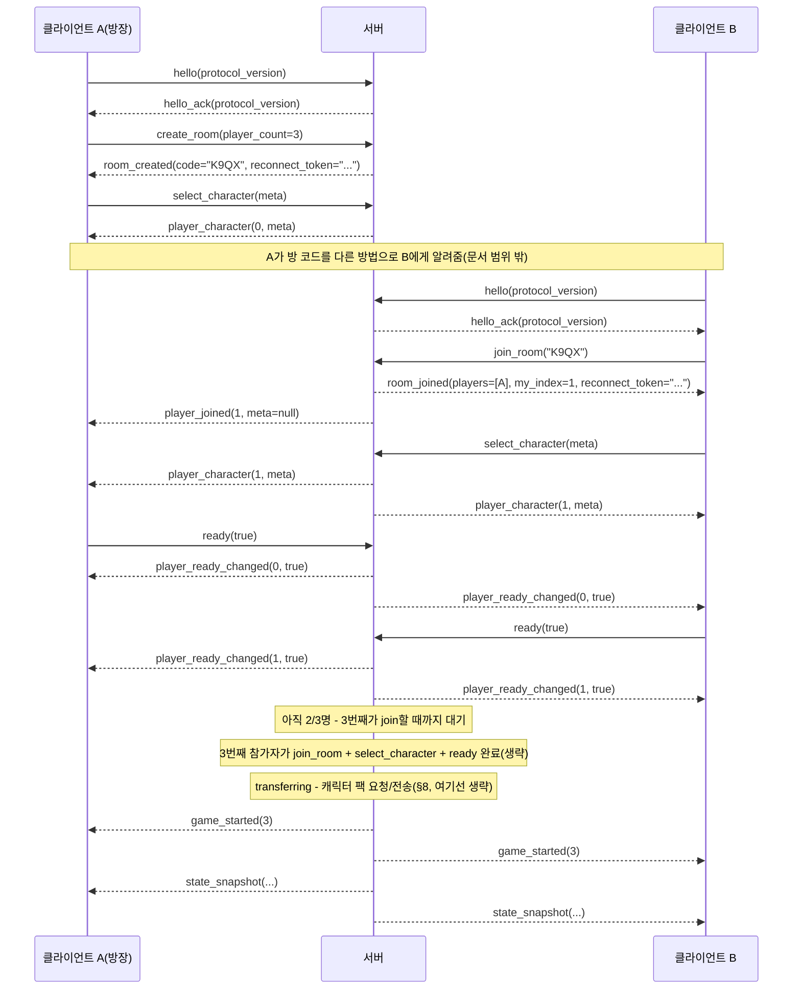

# 온라인 멀티플레이 설계 (Phase 2)

이 문서는 설계만 다룬다. 코드는 아직 한 줄도 없다. 구현을 시작하기 전에
여기 적힌 결정들을 먼저 확정한다.

## 0. 전제

- 웹(HTML5) export를 지원해야 하므로 ENet/UDP는 쓸 수 없다. 전송 계층은
  `WebSocketMultiplayerPeer`(WebSocket, TCP 기반)로 고정한다.
- 웹 빌드는 WebSocket 클라이언트만 될 수 있다. 플레이어가 호스트가 되는
  구조(P2P, 리슨 서버)는 불가능하다 — 별도의 전용 서버 프로세스가 항상 있어야 한다.
- 서버는 이 프로젝트를 headless(dedicated server)로 export한 **같은
  바이너리**로 돌린다. 서버 전용 코드베이스를 따로 두지 않는다.
- 방 인원은 2~4명. 모든 메시지·상태는 처음부터 배열/맵으로 N명을 표현한다.
  "상대 한 명"을 전제로 한 필드(`opponent_score` 같은 것)는 만들지 않는다.
- 게임 규칙의 주인은 서버다. 주사위는 서버의 RNG로만 굴린다. 클라이언트는
  "굴리고 싶다/이 칸에 쓰고 싶다"는 의도만 보내고, 실제 계산과 확정은 서버가 한다.

## 1. 전체 구조

```
                         ┌───────────────────────────────┐
                         │   전용 서버 프로세스 (headless)   │
                         │                                │
                         │  WebSocketMultiplayerPeer(서버)  │
                         │            │                    │
                         │      RoomManager                │
                         │      ├─ Room "AB3F" ─ GameState │
                         │      ├─ Room "K9Q2" ─ GameState │
                         │      └─ Room "..." ─ GameState  │
                         └───────────────────────────────┘
                              ▲        ▲        ▲
                     WebSocket│        │        │WebSocket
                              │        │        │
                        ┌─────┴──┐ ┌───┴────┐ ┌─┴──────┐
                        │클라이언트│ │클라이언트│ │클라이언트│
                        │(웹/데스크톱)│ │(웹/데스크톱)│ │(웹/데스크톱)│
                        └────────┘ └────────┘ └────────┘
```

- 서버 프로세스 하나가 `WebSocketMultiplayerPeer`를 하나만 열어 두고, 접속하는
  모든 클라이언트를 이 소켓 하나로 받는다. "방"은 네트워크 레이어가 아니라
  애플리케이션 레이어의 개념이다 — `RoomManager`가 peer_id를 방 코드에
  매핑하고, 들어오는 메시지를 그 peer가 속한 방의 `GameState` 인스턴스로
  라우팅한다.
- 방 하나 = `GameState` 인스턴스 하나 + 참가자 목록(peer_id, 캐릭터 메타,
  준비 상태) + 방 코드. 서버 프로세스 하나가 여러 방을 동시에 돌린다(각
  방은 서로 완전히 독립).
- 계층 구조: **전송(WebSocketMultiplayerPeer) → 메시지 봉투(타입+페이로드) →
  RoomManager(라우팅) → GameState(규칙)**. GameState는 지금 싱글플레이어에서
  쓰는 것을 그대로 서버에 올린다 — 이미 UI를 몰라도 되게 짜여 있고(원칙 2),
  RNG를 주입받는 구조라(원칙 4) 서버에서 그대로 권위 있는 계산기로 쓸 수
  있다. 이 두 원칙이 처음부터 지켜진 덕분에 Phase 2에서 GameState 자체는
  크게 손댈 일이 없다 - 다만 §6에서 다루는 "자동 진행" 판단 로직 하나는
  GameState의 새 public 함수로 추가된다(디버그 전용 코드에서 빌려 쓰는 게
  아니다 - 이유는 §6 참고).

### 클라이언트 쪽 재사용 전략

싱글플레이어의 `Main.gd`는 `game_state.roll()`/`confirm_category()`를 직접
불러서 상태를 바꾸고, `state_changed` 시그널로 자기 UI를 갱신한다.
멀티플레이 클라이언트는 이 흐름을 뒤집는다:

- 클라이언트는 `GameState`를 계산기로 쓰지 않는다. 서버가 보내주는
  `state_snapshot`을 그대로 받아써서 화면을 그리는, 로직 없는 데이터
  그릇으로만 쓴다(같은 필드 이름을 유지하면 `Main.gd`의 `_refresh_*_ui()`
  계열 함수는 거의 안 고쳐도 된다).
- 사용자가 주사위를 누르면 로컬에서 `game_state.roll()`을 부르는 대신
  `request_roll` 메시지를 서버로 보내고, 화면은 다음 `state_snapshot`이
  올 때 갱신된다(낙관적 갱신은 하지 않는다 — 아래 5절 참고).
- **이벤트와 스냅샷은 다른 채널이다.** `state_snapshot`은 "지금 상태"만
  담는다. 특수 족보 팝업, 승리/패배 보이스, "내 차례" 인사처럼 **한 번
  일어난 사건**은 스냅샷 비교로는 재현할 수 없다(재접속 직후 처음 받는
  스냅샷과 실제 진행 중 상태가 같아 보일 수 있어서, "방금 야추가
  났다"는 사실 자체를 스냅샷만으로는 구분 못 한다). 그래서 서버는
  `GameEvents`에 해당하는 사건이 벌어질 때마다 스냅샷과 별도로 이벤트
  메시지(§2.2 참고)를 방출한다. 클라이언트는 이 메시지를 받으면 **자기
  로컬 `GameEvents`에 그대로 다시 emit**한다 — 그러면 `VoiceBank`/
  `SfxBank`/`Main.gd`의 기존 시그널 구독 코드가 출처가 로컬 GameState든
  네트워크든 상관없이 그대로 동작한다. 이게 가능한 건 애초에 "게임
  이벤트는 GameEvents로만 주고받는다"는 원칙 5를 지켜왔기 때문이다 —
  Phase 2에서 가장 크게 득을 보는 지점이다.
- **어떤 GameEvents 시그널을 릴레이하는가: 게임에서 일어난 사건은 전부
  전달한다.** 예외는 `score_previewed` 하나이며, 이유는 빈도(한 번 굴릴
  때마다 미확정 항목 수만큼 방출됨, 원칙 7)와 클라이언트가 자기
  read-only `GameState`에서 `preview_score()`로 똑같이 다시 계산할 수
  있다는 점이다. **"지금 구독하는 코드가 없다"는 제외 사유가 될 수
  없다** — 오늘 참인 사실이지 규칙이 아니다. `die_held_changed`가 처음에
  정확히 이 이유로 릴레이 목록에서 빠져서 온라인에서 주사위 홀드
  효과음이 안 나는 버그가 실제로 났다(2-4C). 이 규칙은
  `scripts/net/game_event_relay.gd`의 `RELAYED_EVENTS`/`EXCLUDED_EVENTS`
  두 목록으로 코드에도 그대로 박혀 있고, `GameEvents`에 새 시그널이
  추가됐는데 둘 중 어디에도 없으면 자동 테스트가 실패한다.

## 2. 메시지 목록

### 2.0 프로토콜 공통 규칙

**버전 협상.** `PROTOCOL_VERSION`(정수) 상수를 하나 정의하고 클라이언트와
서버 양쪽이 같은 값을 갖는다. 클라이언트는 연결 직후, 다른 어떤 메시지보다
먼저 `hello(protocol_version)`을 보낸다. 서버는:
- 값이 같으면 `hello_ack(protocol_version)`으로 응답하고 정상 진행.
- 다르면 `error(code="PROTOCOL_MISMATCH", message="게임 버전이 다릅니다.
  새로고침해 주세요.")`를 보내고 그 자리에서 연결을 끊는다.

`hello`보다 먼저 다른 메시지가 오거나, 연결 후 일정 시간(예: 5초) 안에
`hello`가 안 오면 서버는 그냥 연결을 끊는다. "일단 진행해보고 나중에
이상해지는" 상태를 원천적으로 안 만든다.

*버전을 올려야 하는 변경*: 메시지의 필드 이름/타입/순서 변경, 기존
메시지에 필수 필드 추가, 메시지 삭제, 검증 규칙이 바뀌어 이전 클라이언트가
보내던 요청이 이제 거부되는 경우, `CATEGORY_NAMES`처럼 클라이언트와
서버가 같은 순서를 전제하는 상수의 변경.

*버전을 안 올려도 되는 변경*: 완전히 새로운 메시지 타입 추가(기존
클라이언트가 원래 안 보내던 것), 기존 메시지에 기본값이 있는 **선택적**
필드 추가, 프로토콜 표면은 그대로고 서버 내부 구현만 바뀐 경우.

이 규칙이 성립하려면 **모르는 메시지 타입을 받아도 크래시하지 않고
조용히 무시해야 한다**는 전제가 필요하다 - 2-4C에서 실제로 확인함:
클라이언트(`game_client.gd`의 `_handle_packet`)는 `match`에 해당하는
분기가 없으면 아무 것도 안 하고 넘어가고, 서버(`server_main.gd`)는
`_:` 기본 분기에서 `error(INVALID_ARGUMENT)`를 돌려줄 뿐 연결을 끊지
않는다. 둘 다 안전하다는 게 코드로 확인됐으므로, 새 이벤트 메시지
5개(`die_held_changed`/`score_committed`/`yacht_scored`/`turn_ended`/
`game_state_started`)와 `set_player_count`/`room_player_count_changed`
(2-3) 전부 버전을 안 올리고 추가했다.

**메시지 크기 상한.** `MAX_MESSAGE_BYTES := 65536`(64KB)을 상수로 둔다.
이보다 큰 메시지가 오면 서버는 내용을 읽지 않고 그 연결을 즉시 끊는다.
지금 정의된 메시지는 전부 이 값의 몇 %도 안 되지만(§5), 2-5에서 캐릭터
팩(§8)을 청크로 나눠 보낼 때 이 값이 상한선이 된다.

**규칙: 청크(또는 그 밖의 바이너리를 담는 메시지)의 크기는 Base64
오버헤드(약 1.33배)와 봉투(타입/순번/총 개수 등 JSON 필드)를 다 더한
뒤에도 `MAX_MESSAGE_BYTES`를 넘지 않아야 한다.** 이 프로젝트의 메시지는
JSON으로 봉투를 싸므로, 바이너리를 그 안에 넣으려면 Base64로 인코딩해야
하고 그 순간 부피가 커진다 - 원본 바이트 수만 보고 청크 크기를 정하면
안 된다(구체적인 계산은 §8). **`MAX_MESSAGE_BYTES`와 청크 크기는 서로
독립적으로 못 바꾼다** - 둘 중 하나를 조정할 때는 반드시 이 관계식을
다시 확인한다.

### 2.1 클라이언트 → 서버

| 메시지 | 페이로드 | 설명 |
|---|---|---|
| `hello` | `protocol_version: int` | 연결 직후 가장 먼저 보내야 하는 메시지(§2.0). |
| `create_room` | `player_count: int (2~4)` | 새 방을 만든다. 만든 사람이 방의 0번 슬롯을 차지한다. |
| `join_room` | `code: String, reconnect_token: String (선택)` | 기존 방에 들어간다. `reconnect_token`을 같이 보내고 그 방의 어느 슬롯이 발급했던 토큰과 정확히 일치하면 그 슬롯으로 복귀한다(§6). 없거나 안 맞으면 새 참가자로 취급. |
| `select_character` | `meta: Dictionary { id: String, display_name: String, pack_hash: String }` | 로비에서 캐릭터(캐릭터 메타)를 고른다. 아무 때나 다시 불러 바꿀 수 있다(게임 시작 전까지). `pack_hash`는 2-5에서 추가된 선택 필드(sha256 hex 64자 또는 빈 문자열 - §8 참고). |
| `ready` | `ready: bool` | 준비 완료/취소 토글. |
| `set_player_count` | `player_count: int (2~4)` | 방장이 로비에서 인원수를 바꾼다(§10 결정 1과 달리 2-3에서 추가 - 이미 들어온 인원보다 낮출 수 없고, 로비 단계에서만 허용). |
| `request_roll` | (없음) | 주사위를 굴리고 싶다. |
| `request_hold` | `index: int (0~4)` | 그 주사위의 고정 상태를 토글하고 싶다. |
| `request_score` | `category: int (0~11)` | 그 칸에 확정하고 싶다. |
| `leave` | (없음) | 방을 나간다. |
| `request_character_pack` | `owner_index: int` | 2-5(§8) - `transferring` 단계에서 "그 슬롯의 캐릭터 팩이 필요하다"고 요청한다. 캐시에 이미 있으면 아예 안 보낸다. |
| `upload_pack_chunk` | `hash: String, sequence: int, total_chunks: int, total_bytes: int, data: String(base64)` | 2-5(§8) - 지금 순번인 소유자가 자기 팩을 청크로 나눠 보낸다. |
| `pack_ready` | (없음) | 2-5 후속(§8.5-2) - "내가 받아야 할 팩을 전부 처리했다"는 영수증(성공/실패/애초에 받을 게 없었음 전부 포함). 서버는 방 전원에게서 이걸 받은 뒤에만 `game_started`를 보낸다. |
| `pong` | (없음) | 2-6(§6) - 서버의 `ping`에 대한 응답. 서버는 이 메시지 자체가 아니라 "무엇이든 왔다"는 사실로 마지막 통신 시각을 갱신하므로 별도 처리는 없다. |

### 2.2 서버 → 클라이언트

| 메시지 | 페이로드 | 설명 |
|---|---|---|
| `hello_ack` | `protocol_version: int` | 버전이 맞음(§2.0). 이 응답을 받기 전까지 클라이언트는 `create_room`/`join_room`을 보내면 안 된다. |
| `room_created` | `code: String, player_count: int, reconnect_token: String` | `create_room` 응답. `reconnect_token`은 이 접속(0번 슬롯) 전용이며 그 클라이언트에게만 보내진다. |
| `room_joined` | `players: Array[{player_index:int, meta:Dictionary, ready:bool}], my_index: int, reconnect_token: String` | `join_room` 성공 응답 - 지금 방에 있는 전원 정보. `reconnect_token`은 이번에 새로 들어온 슬롯 전용(재접속으로 기존 슬롯을 되찾은 경우는 원래 발급됐던 토큰이 그대로 유효하므로 다시 안 줘도 됨). |
| `player_joined` | `player_index: int, meta: Dictionary` | 로비에 있는 동안 다른 사람이 들어왔을 때, 이미 있던 사람들에게. |
| `player_character` | `player_index: int, meta: Dictionary` | 누군가 `select_character`로 캐릭터를 바꿨을 때 전원에게. `meta`에는 `id`/`display_name`/`pack_hash`가 담긴다(`pack_hash`는 2-5, §8). |
| `player_ready_changed` | `player_index: int, ready: bool` | 준비 상태가 바뀔 때 전원에게. |
| `room_player_count_changed` | `player_count: int` | 방장이 `set_player_count`로 인원수를 바꿨을 때 전원에게(2-3에서 추가). |
| `game_started` | `player_count: int` | 방이 다 찼고 전원 준비되어 게임이 시작됨(§3의 로비 상태 기계에서 `transferring`을 거친 뒤 - 2-5부터는 실제 캐릭터 팩 전송이 끝나거나 포기된 뒤). 이 직후 첫 `state_snapshot`이 따라온다. **`game_state_started`(아래)와 다른 메시지다** - 이건 로비 종료를 알리는 것뿐이고, 실제 `GameState.start_turn()`의 결과는 스냅샷과 `game_state_started`로 따로 온다. |
| `state_snapshot` | §5 참고 | 지금 상태 전체. 서버 상태가 바뀔 때마다(요청 처리 결과) 방 전원에게. |
| `dice_rolled` | `player_index:int, values:Array[int](5), rerolls_left:int` | 싱글플레이어의 `GameEvents.dice_rolled`와 동일 - SfxBank가 굴림 효과음에 쓴다. |
| `die_held_changed` | `player_index:int, index:int, held:bool` | 주사위 고정/해제 - SfxBank가 홀드 효과음에 쓴다(2-4C에서 추가 - 처음엔 빠져 있어서 온라인에서 이 효과음만 안 났다). |
| `special_hand_rolled` | `player_index:int, category:int, points:int` | 특수 족보 팝업/보이스 트리거. |
| `score_committed` | `player_index:int, category:int, points:int` | 칸이 확정될 때마다(값과 무관하게). 지금은 구독하는 연출이 없지만, "구독자가 없다"는 릴레이 제외 사유가 아니므로 보낸다(2-4C, 위 규칙 참고). |
| `yacht_scored` | `player_index:int` | 야추 칸을 50점으로 확정하는 순간(굴림 시점의 `special_hand_rolled`와는 다른, 확정 시점 신호). 2-4C에서 추가, 현재 구독자 없음. |
| `bonus_achieved` | `player_index:int` | 상단 보너스(63점) 달성 보이스 트리거. |
| `zero_scored` | `player_index:int, category:int` | 0점 확정(야추 포기 등) 보이스 트리거. |
| `turn_ended` | `player_index:int` | 그 플레이어의 턴이 끝날 때(다음 턴 시작 여부와 무관하게 항상). 2-4C에서 추가, 현재 구독자 없음. |
| `turn_started` | `player_index:int` | 새 턴 시작 - "내 차례" 인사 트리거. |
| `game_ended` | `winners:Array[int], scores:Array[int]` | 게임 종료 - 승/패 보이스 시퀀스 트리거. |
| `game_state_started` | `player_count:int` | `GameState.start_turn()`이 내는 `GameEvents.game_started`를 실어 나른다(2-4C에서 추가). 위 `game_started`(로비 종료 알림)와 이름이 같으면 클라이언트가 게임 시작을 두 번 받게 되어 일부러 다른 이름을 썼다 - 로컬로 재방출할 때는 원래 이름(`GameEvents.game_started`)으로 되돌아간다. 지금은 구독하는 연출이 없다(1-4C 인사 연출은 이 메시지가 아니라 로비 `game_started` 수신 시점에 클라이언트가 직접 트리거함). |
| `player_left` | `player_index: int, reason: String` | `reason`은 `"left"`(자기가 나감)/`"disconnected"`(연결 끊김, 재접속 유예 중)/`"timeout"`(유예 종료, 확정 이탈 - §6). `"disconnected"`와 `"timeout"`은 같은 플레이어에 대해 순서대로 두 번 올 수 있다 - 클라이언트는 `"timeout"`을 받으면 "자동 진행 중" 표시를 계속 띄운다. |
| `transferring_started` | (없음) | 2-5(§8) - 로비가 다 찼고 `transferring` 단계에 들어감. 각 클라이언트는 이걸 받으면 자기 캐시를 확인해서 필요한 것만 `request_character_pack`을 보낸다. |
| `pack_upload_requested` | `hash: String` | 2-5(§8) - 방 전체에 방송(특정 수신자에게만 보내지 않음). 그 해시의 소유자는 이걸 보고 업로드를 시작하고, 나머지는 "지금 누구 걸 기다리는지" UI를 갱신한다. |
| `pack_chunk` | `hash: String, sequence: int, total_chunks: int, data: String(base64)` | 2-5(§8) - 그 해시를 요청한 클라이언트에게만. 서버는 전체 바이트를 버퍼링하지 않고 오는 즉시 그대로 릴레이한다. |
| `pack_transfer_failed` | `hash: String, reason: String` | 2-5(§8) - 방 전체에 방송. `reason`은 `"timeout"`(60초 안에 소유자가 업로드를 못 끝냄) 또는 `"oversized"`(소유자가 보낸 `total_bytes`가 상한을 넘음). 이 해시를 기다리던 클라이언트는 조용히 기본 캐릭터로 대체한다. |
| `player_reconnected` | `player_index: int` | 재접속 유예 중이던 플레이어가 돌아왔을 때 전원에게(§6). 확정 이탈(`"timeout"`)까지 넘어간 뒤에 돌아와도 이 메시지가 온다(§6 - 유예가 끝났다고 재접속 자체를 막지는 않기로 확정). |
| `ping` | (없음) | 2-6(§6) - 끊김 감지용. 방 전체가 아니라 접속 하나하나에 개별 전송(방송 아님). |
| `player_timer` | `player_index: int, kind: String("turn"\|"reconnect"), seconds_left: int` | 2-6, §6에 없던 요구사항이라 이번에 추가 - 턴 제한/재접속 유예 카운트다운을 화면에 표시하기 위해 1초 주기로 방송한다. |
| `error` | `code: String, message: String` | 요청이 거부됨(§7 참고). `code`는 프로그램이 분기하는 값(`NOT_YOUR_TURN`/`PROTOCOL_MISMATCH`/`NOT_HOST`/`NOT_IN_GAME`/`ROOM_NOT_FOUND`/`ROOM_FULL`/`GAME_ALREADY_STARTED`/`INVALID_ARGUMENT` 등, 정의는 `scripts/net/protocol.gd`), `message`는 사람이 읽는 설명. |

## 3. 방 생성/입장 흐름

### 로비 상태 기계

```
lobby(대기/캐릭터 선택/준비)
   │  전원 join + 전원 ready(true)
   ▼
transferring(캐릭터 팩 전송 중) ◄──────────────┐
   │  전송 완료(또는 v1처럼 애초에 전송할 게 없으면 즉시)   │
   ▼                                    │ 전원 join(재대전 포함) + 전원 ready(true)
in_game                                 │
   │  game_over                          │
   ▼                                    │
rematching(재대전 대기) ─────────────────┘
```

`transferring`은 전원이 준비된 뒤, 실제 게임이 시작되기 전에 서로의
캐릭터 팩(§8)을 주고받는 단계다. 2-5에서 실제 전송을 구현했다 - 자세한
내부 상태 기계(`COLLECTING` → `TRANSFERRING_PACK` → ... → `DONE`)와
타임아웃/실패 처리는 §8 참고. 아무도 남에게 없는 팩을 안 갖고 있으면
(전원이 내장 기본 캐릭터거나 서로 완전히 같은 캐릭터를 골랐으면) 큐가
비어 즉시 통과한다 - v1 당시의 "체감상 바로 넘어감" 동작이 이 특수
경우로 그대로 남아있다.

**구현(2-6B) - `ended`는 막다른 길이 아니라 `rematching`으로 이어진다.**
이 문서를 처음 쓸 때는 게임이 끝나면(`ended`) 그걸로 방의 생애가
끝난다고 가정했지만, 실제 구현에서는 "게임이 막 끝남"과 "재대전 투표를
기다림"을 굳이 구분할 실익이 없어서 `ended`라는 별도 상태를 두지 않고
게임이 끝나는 즉시 `rematching`으로 들어간다(코드의 `Room.State.REMATCHING`,
`begin_rematch_wait()`). `rematching`은 `lobby`와 거의 같은 성격의
상태다 - `select_character`/`ready`/`set_player_count`/신규 `join_room`을
전부 다시 받아준다(`Room.accepts_lobby_actions()`가 `LOBBY`와
`REMATCHING` 둘 다를 "로비류 행동을 받는 상태"로 취급). 차이는 두
가지뿐이다: ① 게임이 최소 한 번 끝난 뒤라 슬롯에 이전 판의
캐릭터/토큰이 이미 채워져 있고(다시 고르지 않으면 그대로 유지 - 캐릭터가
안 바뀌면 팩 재전송도 없음), ② 대기 상한이 있다(아래 참고 - 무한정
기다리지 않는다). 전원이 다시 `ready(true)`가 되면 `lobby`가
`transferring`으로 넘어갈 때와 완전히 같은 경로(`_maybe_start_game()`)로
`transferring`에 재진입하고, 그 다음 `_finish_transferring()`이
`Room.start_new_game()`으로 **완전히 새 `GameState`**를 만들어 `in_game`에
들어간다 - 지난 판의 점수/굴림 상태가 한 조각도 안 남고, 첫 턴은 항상
플레이어 0(P1)부터 시작한다(순서를 돌리지 않음). 방 코드와
`RoomManager`가 관리하는 방 객체 자체는 게임을 몇 판을 거듭해도 계속
같은 것을 재사용한다 - 방이 사라지는 건 인원이 완전히 0명이 될 때뿐이다.



- 방은 `create_room`에서 정한 인원(2~4)이 **정확히 다 차고 전원이
  `ready(true)`일 때** 자동으로 시작된다. 방장이 인원을 못 채운 채로
  조기 시작하는 기능은 없다 — 필요하면 처음부터 더 적은 인원으로 방을
  만들면 된다(설계를 단순하게 유지하기 위한 선택, §10 핵심 결정 참고).
- 로비 중 누가 나가면(`leave`) 그 슬롯이 비고 다른 사람이 채울 수 있다.
  방이 완전히 비면 서버가 방을 없앤다.
- `player_index`는 입장 순서(0부터)로 고정된다. 게임이 시작된 뒤에는
  바뀌지 않는다(중간에 누가 나가도 나머지 인덱스가 당겨지지 않음 - §6).
- `reconnect_token`은 슬롯을 처음 차지하는 순간(`create_room`의 0번 슬롯,
  또는 새로 `join_room`한 슬롯)에 딱 한 번 발급되고 그 슬롯이 방에 남아
  있는 동안 안 바뀐다. 게임이 끝나면(방이 사라지면) 같이 폐기된다 - 이미
  끝난 게임의 토큰으로 재접속을 시도해도 그 방 자체가 없으므로 자연히 거부된다.

## 4. 턴 권한 검사

서버는 요청마다 아래를 검사하고, 하나라도 걸리면 그 요청을 완전히
무시하지 않고 `error`로 이유를 알려준다(클라이언트가 왜 안 됐는지 알아야
UI를 고칠 수 있으므로).

| 요청 | 검사 항목 |
|---|---|
| `request_roll` | ① 보낸 사람이 `current_player`인가 ② 게임이 끝나지 않았는가 ③ `rolls_left > 0`인가 |
| `request_hold` | ① 보낸 사람이 `current_player`인가 ② `index`가 0~4 범위인가 ③ 이번 턴에 한 번이라도 굴렸는가(`has_rolled`) - 굴리기 전에는 고정할 주사위 값 자체가 없다 |
| `request_score` | ① 보낸 사람이 `current_player`인가 ② `category`가 0~11 범위인가 ③ 이번 턴에 굴렸는가(`has_rolled`) ④ 그 플레이어가 그 칸을 아직 안 썼는가(`player_score_confirmed[player][category] == false`) |
| `select_character` / `ready` | 게임이 아직 시작 전인가(로비 단계에서만 허용) |
| `join_room` | ① 그 코드의 방이 존재하는가 ② 아직 자리가 남았는가(`player_count`보다 적게 참가 중) ③ 게임이 이미 시작되지 않았는가 |
| `create_room` | `player_count`가 2~4 범위인가 |

## 5. 상태 동기화 방식 — 전체 스냅샷 (검토 결과)

**결론: 매번 전체 스냅샷을 보낸다. 델타(변경분) 동기화는 안 한다.**

검토한 근거:

- **상태가 실제로 작다.** 스냅샷에 들어갈 값은 주사위 5개(1~6), 고정
  여부 5개(bool), 굴리기 횟수 1개, `has_rolled` 1개, `current_player`
  1개, 그리고 플레이어별로 칸 12개 × (확정 여부 bool + 점수 int) +
  보너스 달성 bool, 마지막으로 `game_over` bool. 4인 기준으로 다 합쳐도
  스칼라 값 100개가 안 된다 - JSON으로 직렬화해도 1KB를 한참 밑돈다.
  이 정도는 매 턴, 심지어 매 주사위 고정 토글마다 통째로 보내도
  대역폭 문제가 안 된다.
- **전송 순서는 TCP가 보장한다.** `WebSocketMultiplayerPeer`는 WebSocket
  위에서 돌고 WebSocket은 TCP 기반이라, 도착한 바이트의 순서 뒤바뀜은
  신경 쓸 필요가 없다. 델타 동기화가 정말 필요해지는 이유(UDP에서 순서가
  바뀌어도 최종 상태에 수렴시켜야 하는 문제)가 이 프로젝트에는 없다.
  **단, "유실이 없다"는 뜻은 아니다** - §8.5-6에서 실제로 겪은 대로,
  TCP는 보낸 바이트가 순서대로 도착하는 것만 보장하고, 그 바이트를
  애플리케이션이 실제로 읽어가는 속도(엔진의 수신 버퍼 크기)까지
  보장하지 않는다. 수신 버퍼가 넘치면 애플리케이션 계층(`WebSocketPeer`)
  에서 조용히 버려질 수 있다 - 이건 이 상태 스냅샷(1KB 미만)에는 전혀
  해당하지 않지만(§8.5-6에서 4인 최악 스냅샷도 693바이트로 실측 확인),
  2-5의 청크 메시지(43.8KB)처럼 버퍼 크기(기본 65,535바이트)에 근접한
  큰 메시지를 연달아 보낼 때는 실제로 발생한다.
- **전체 스냅샷은 재접속을 공짜로 해결한다.** 델타 방식이면 "재접속한
  클라이언트에게 지금까지의 델타를 어디서부터 다시 보낼지" 같은
  버전 관리가 필요해진다. 전체 스냅샷은 그냥 지금 상태를 한 번 더
  보내면 끝이다 - §6의 재접속 정책과 맞물려서 설계가 단순해진다.
- **디버깅이 쉽다.** 스냅샷 하나만 로그로 찍어보면 그 시점의 게임
  상태를 완전히 알 수 있다. 델타 방식은 처음 상태 + 델타 이력을
  전부 재생해야 지금 상태를 알 수 있어서, 특히 이 프로젝트처럼 아직
  실제 네트워크 코드가 없는 단계에서 굳이 먼저 도입할 이유가 없다.

델타가 실제로 필요해지는 경우(초당 수십 회 갱신되는 실시간 게임, 상태가
수 MB급인 게임)에 해당하지 않으므로, 전체 스냅샷 방식이 맞다고 결론
내린다. 상태 크기가 나중에 실제로 커지면(예: 채팅 로그를 스냅샷에
같이 넣는다든지) 그때 다시 판단한다.

## 6. 연결 끊김 처리 정책

### 자동 진행 로직은 GameState에 정식으로 산다(디버그 코드를 빌려 쓰지 않음)

싱글플레이어 디버그 단축키(`scripts/dev/debug_hotkeys.gd`)의
`_auto_confirm_one()`/`_auto_finish_game()`이 겉보기엔 "누군가 대신
진행해주는" 로직과 똑같아 보이지만, **그대로 서버에 옮기면 안 된다.**
그 파일은 `BuildInfo.DEBUG_MODE`로 켜고 꺼지는 개발용 코드다. 정식
출시 때 `DEBUG_MODE`를 `false`로 되돌리면(반드시 그래야 한다 -
`docs/deployment_checklist.md` 참고) 서버의 AFK 처리까지 같이 죽어버린다.
이 프로젝트에서 이미 한 번 겪은 문제이기도 하다 - 1-8 사전 정비 때
`debug_hotkeys.gd`가 `DEBUG_MODE=false`면 자기 자신을 `queue_free()`해서,
`Main.gd`가 들고 있는 참조가 나중에(실제 게임 기능인 특수 족보 연출
처리 중) 무효해질 수 있는 버그가 잠복해 있었다(`CLAUDE.md`의 1-8 사전
정비 기록 참고). "디버그 스위치를 끄면 그 뒤에 숨어 있던 진짜 동작까지
같이 죽는다"는 같은 패턴을 AFK 로직에서 반복하지 않는다.

대신:
- `GameState`에 정식 public 함수를 추가한다(가칭
  `auto_confirm_least_damaging(player_index: int) -> int` - "이 플레이어
  대신 안전하게 한 수 두고 그 결과 카테고리를 돌려준다"는 의미).
  `DEBUG_MODE`와 완전히 무관하게 항상 존재하고 항상 동작한다.
- `debug_hotkeys.gd`는 이 함수를 **부르기만 하는 얇은 껍데기**가 된다.
  판단 로직 본체가 디버그 전용 파일에 남아 있으면 안 된다.
- 서버의 턴 타임아웃 처리(아래)도 같은 함수를 그대로 부른다 - 로컬
  디버그 자동 진행과 서버 AFK 자동 진행이 "어느 칸을 고를지"에 대해
  다른 기준을 쓰면 안 되므로, 판단 기준을 두 곳에 따로 안 둔다.
- **아직 한 번도 안 굴린 상태(`has_rolled == false`)로 이 함수가 불리면
  먼저 정확히 한 번만 굴린다.** 1-3B에서 첫 굴림을 플레이어가 직접
  하도록 바꿔서(자동 굴림 없음), 턴이 막 시작된 직후 아무 주사위 값도
  없는 채로 끊기는 경우가 생길 수 있다 - 그 상태로는 "어느 칸이 손해가
  적은지" 판단할 값 자체가 없으므로 굴리는 게 먼저다. **이때 리롤은
  하지 않는다** - 한 번 굴리고 그 결과로 바로 확정한다(리롤까지
  최적화하는 건 "안전하게 한 수 두는" 목적을 넘어서는 과한 자동
  플레이라고 본다).
- 어떤 칸을 고를지의 기준(가칭): 지금 굴린 값으로 0점이 아닌 칸이 있으면
  그중 점수가 가장 높은 칸을 확정한다. 전부 0점이면 아직 안 쓴 칸 중
  **기대 손실이 가장 작은 칸**(상단 숫자 칸처럼 최대 배점이 낮은 칸)부터
  포기한다 - 야추/라지 스트레이트처럼 배점이 큰 칸을 무의미하게
  0점으로 날리지 않는다. 정확한 우선순위 목록은 구현 시점에 정한다.
- 이 함수는 자동 테스트 대상이다. `DEBUG_MODE`를 켜지 않고 헤드리스
  테스트에서 직접 호출해서 검증한다(기존 `test_*.gd` 스위트와 같은 방식).
  최소한 아래 두 경우를 각각 테스트한다:
  - 이미 굴린 상태에서 호출 - 그 다이스 값 그대로 판단해서 확정.
  - **`has_rolled == false`인 상태에서 호출 - 정확히 한 번만 굴려지고
    (`rolls_left`가 정확히 1만 줄어듦), 그 결과로 바로 확정되는지.**

### 끊김 감지

`WebSocketMultiplayerPeer`의 peer 연결 종료 시그널로 즉시 감지되는
경우(브라우저 탭을 닫음 등)는 바로 `player_left(reason="disconnected")`를
방출한다. 네트워크가 응답 없이 사라지는 경우(와이파이 끊김 등)를 대비해
15초간 무응답이면 끊긴 것으로 간주한다.

**구현(2-6) - "WebSocket 레벨"이 아니라 애플리케이션 레벨 ping/pong으로
직접 만들었다.** 이 문서를 처음 쓸 때는 엔진의 WebSocket 프로토콜 레벨
ping/pong(RFC 6455 컨트롤 프레임)을 가리켰지만, 실제 구현 시점엔
`docs/multiplayer.md` §8.5-6에서 "WebSocket 관련 엔진 동작을 웹/네이티브
양쪽에서 검증 없이 믿으면 안 된다"는 교훈을 이미 얻은 뒤였다(받는 쪽
버퍼 기본값이 브라우저에서만 문제를 일으켰던 사고). 같은 이유로 이번엔
검증되지 않은 엔진 레벨 기능에 기대지 않고, 서버가 각 접속의 마지막
통신 시각(`_last_seen_msec` - ping/pong 전용이 아니라 어떤 메시지든
오면 갱신됨)을 직접 추적해서 5초마다 애플리케이션 레벨 `ping`(§2.2)을
보내고, 15초 무응답이면 `peer.disconnect_peer()`로 직접 끊는다. 클라이언트는
`ping`을 받으면 즉시 `pong`(§2.1)으로 응답한다.

### 재접속 허용 (신원 확인 포함)

허용한다. 다만 **방 코드만으로는 재접속을 승인하지 않는다** - 방 코드는
같이 놀자고 친구에게 알려주는 값이라 비밀이 아니다. 방 코드만 알면
누구든 끊긴 사람의 자리를 가로챌 수 있게 되는 건 막아야 한다.

- 슬롯을 처음 차지할 때(§3) 서버가 그 접속에게만 `reconnect_token`(충분히
  긴 무작위 문자열)을 발급한다.
- 재접속은 `join_room(code, reconnect_token)`으로 방 코드와 토큰을 **둘 다**
  보내야 한다. 토큰이 그 방의 그 슬롯에 기록된 값과 정확히 일치할 때만
  기존 `player_index`로 복귀시킨다.
- 토큰이 없거나 틀리면 새 참가자로 취급한다 - 자리가 없으면(끊긴 사람
  몫이 아직 유예 중이라 자리로 안 잡히면) `error(ROOM_FULL)`로 거부.
- 토큰은 그 방·그 게임에서만 유효하고, 방이 없어지면(게임 종료 등) 같이
  폐기된다.
- 재접속에 성공하면 서버는 방 전원에게 `player_reconnected(player_index)`를
  보낸다.
- 재접속 유예 시간은 **60초**(`NetProtocol.IN_GAME_RECONNECT_GRACE_MSEC` -
  `TRANSFERRING`/`IN_GAME` 전용, `REMATCHING`은 아래 별도 항목 참고) - 이
  안에 안 돌아오면 그 슬롯은 "확정 이탈"로 넘어간다(아래). 유예가 끝나도
  슬롯 자체를 없애거나 인덱스를 당기지는 않는다(§0의 "N명을 전제로 설계"
  원칙 - 게임 중간에 인원수가 바뀌면 점수표 레이아웃부터 다시 계산해야
  해서 복잡도가 크게 늘어난다). **원래 2분이었으나 실제로 플레이해보니
  너무 길어서 60초(턴 제한과 같은 값)로 줄였다**(사용자 지적) - 자세한
  경계 처리는 아래 "턴 제한 시간" 항목 참고.
- **설계 확정(2-6) - 확정 이탈 이후에도 재접속은 계속 허용한다.** 이
  문서를 처음 쓸 때는 명시하지 않았던 부분이다. 유예가 끝나면 그
  순간부터 그 플레이어의 턴은 대기 없이 즉시 자동 처리되지만, 토큰
  자체가 무효화되지는 않는다 - 나중에 같은 방 코드+토큰으로 돌아오면
  똑같이 슬롯을 되찾고 `player_reconnected`도 그대로 온다(명시적
  `leave()`만 토큰을 완전히 파기한다 - 아래 "명시적 나가기" 참고). 그
  뒤로는 다시 정상적으로(연결된 사람 기준 60초 턴 제한으로) 진행된다.
- **명시적으로 나가는 것(`leave()`)은 게임 도중이라도 유예를 안 거친다.**
  뜻하지 않게 끊긴 것과 스스로 나가겠다고 한 것은 다르다 - 후자는 그
  자리에서 슬롯을 완전히 비우고 토큰도 같이 파기한다(유예를 기다렸다가
  확정 이탈로 넘어가는 절차 자체를 생략). 스스로 나가겠다고 한 사람을
  더 기다려줄 이유가 없기 때문이다.

### 재대전 대기 중 끊김(2-6B, 친구 대상 실제 베타 테스트 후속으로 설계 정정)

게임이 끝나고 `rematching`(§3)으로 들어간 뒤에도 누군가 끊길 수 있다.
"연결이 끊기면 슬롯을 살려 재접속을 기다린다"는 원칙 자체는 그대로
적용한다 - `RoomManager.remove_peer()`의 그레이스 판정에
`Room.State.REMATCHING`을 `TRANSFERRING`/`IN_GAME`과 나란히 추가하는
것으로 끝난다(`voluntary`가 아니면 슬롯을 비우지 않고 `GRACE_PERIOD`로
표시).

**여기서부터는 최초 설계와 달라진 부분이다.** 처음엔 "`rematching` 중
끊긴 사람도 방 전체 재대전 대기 시간(`REMATCH_READY_TIMEOUT_MSEC`, 2분)
하나로 충분하고, 슬롯별 그레이스 타이머(`IN_GAME_RECONNECT_GRACE_MSEC`,
60초)는 안 써도 된다"고 판단했었다. 그런데 이 판단은 **틀렸다** -
`mark_slot_disconnected()`가 여전히 60초 기준으로 슬롯의 개별 마감
시각(`slot_disconnect_deadline_msec`)을 세팅하고 있었는데, 그 마감을
실제로 검사해서 슬롯을 내보내는 코드(`is_grace_expired()`를 부르는
`_service_in_game_rooms()`)는 `room.state == IN_GAME`인 방만 처리하도록
필터링돼 있어서, `rematching` 중에는 이 60초 시계가 **설정만 되고 한
번도 확인되지 않는 죽은 값**이었다. 그래서 실제로 유효했던 상한은
처음부터 `REMATCH_READY_TIMEOUT_MSEC`(2분) 하나뿐이었다 - "60초보다
넉넉하다"가 의도한 설계가 아니라 우연이었던 셈이고, 다음에 누가
`_service_in_game_rooms()`의 상태 필터를 무심코 넓히면 조용히 60초로
줄어드는 사고를 만들 수 있는 취약한 상태였다.

사용자 지적: "게임 중에는 다른 사람이 이 사람의 턴을 기다리지만,
결과 화면/재대전 대기 중에는 아무도 기다리지 않는다" - 그러니 굳이
게임 도중과 같은 짧은 유예를 줄 이유가 없고, 오히려 더 넉넉하게 줘도
된다. 그래서 이제 **세 값이 서로 다른 역할로 명확히 분리됐다**:

- `NetProtocol.IN_GAME_RECONNECT_GRACE_MSEC`(60초) - `TRANSFERRING`/
  `IN_GAME` 중 끊긴 슬롯 전용(다른 사람이 실제로 기다리는 상황).
- `NetProtocol.POST_GAME_RECONNECT_GRACE_MSEC`(**3분**, 신규) -
  `REMATCHING` 중 끊긴 슬롯 전용. `RoomManager.remove_peer()`가
  `room.state`를 보고 둘 중 맞는 값을 골라 `mark_slot_disconnected()`에
  넘긴다. 게임 도중 이미 끊긴 채였던 슬롯이 게임 종료로 `REMATCHING`에
  들어가는 순간에도 `Room.begin_rematch_wait()`가 그 슬롯의 마감 시각을
  이 3분 기준으로 다시 잡아준다(안 그러면 게임 도중 확보했던 60초의
  나머지 몇 초만 남은 채로 결과 화면에 들어가게 된다). 이 유예가 실제로
  만료되면(`Room.grace_expired_disconnected_slots()`,
  `server_main.gd::_service_rematch_rooms()`가 매 프레임 확인) 방 전체
  대기와 무관하게 그 슬롯 하나만 즉시 내보낸다.
- `NetProtocol.REMATCH_READY_TIMEOUT_MSEC`(2분, 기존 유지) - **연결은
  멀쩡한데 그냥 "한 판 더"를 안 누른** 슬롯 전용(`Room.not_ready_connected_slots()`가
  끊긴 슬롯을 제외하고 골라낸다). 끊긴 슬롯은 이제 위 3분 유예로 따로
  관리되므로 이 방 전체 타이머의 대상이 아니다 - 그래서 2분/3분이라는
  서로 다른 값이 이제는 실제로 의미가 있다(예전엔 이 값이 끊긴 사람에게도
  사실상 유일한 상한이라 둘의 차이가 무의미했다).

두 타임아웃(개별 3분 유예/방 전체 2분 대기) 모두, 끝나면 그 슬롯을
강제로 비운다(`RoomManager.force_vacate_slot()`) - `player_left(reason="timeout")`을
방송한 뒤 그 방은 다시 사람을 기다리는 `rematching` 상태로 남는다(§3 -
`rematching`도 신규 참가를 받아준다). 완전히 나가는 것과 같은 취급이라
토큰도 같이 파기된다 - 재접속 유예처럼 "이탈 후에도 토큰으로 돌아올 수
있다"는 여기선 적용하지 않는다(대기 시간 자체가 이미 충분히 줬으므로
한 번 더 봐줄 이유가 없다).

남은 시간은 1초 주기로 `player_timer(kind="rematch")`로 방송한다(§2.2) -
다른 카운트다운(`kind="turn"`/`"reconnect"`)과 마찬가지로 이벤트가
아니라 `Time.get_ticks_msec()` 기준으로 계산해서, 멈춘 것처럼 보이는
카운트다운(2-5에서 겪은 그 문제)이 재발하지 않게 한다. **이 카운트다운은
여전히 방 전체 2분 타이머 기준이다** - 끊긴 사람에게 부여된 개별 3분
유예는 화면에 별도로 표시하지 않는다(그 사람은 어차피 화면을 보고 있지
않고, 연결된 다른 플레이어 입장에서는 "방이 언제 포기하는지"인 2분
쪽이 더 의미 있는 정보이기 때문 - 사소한 표시상의 단순화이며 필요해지면
나중에 분리 가능).
- **실제 소켓 검증 중 발견하고 고친 버그**: 두 슬롯이 같은 순간에
  타임아웃되면(둘 다 준비 안 한 채 방치), 먼저 처리된 슬롯을 비우고 나서
  두 번째 슬롯의 퇴장을 방송하면 `_broadcast_room()`이 그 순간의
  `room.slots`를 그대로 훑기 때문에 **이미 비워진 첫 번째 슬롯의
  주인은(소켓은 아직 열려 있는데도) 두 번째 사람의 `player_left`를 못
  받는다.** `_service_rematch_rooms()`를 방송을 전부 먼저 끝내고 나서
  비우는 순서로 고쳐서 해결했다(두 방 있는 반복 while 루프).

### 베타 트러블슈팅 - "서버 문제"와 "터널 문제"를 가르는 기준(사용자 지정)

친구 대상 비공개 베타는 Render 상시 배포(§0, 2-7 - 아직 안 함) 전이라
로컬 서버를 **Cloudflare 임시 터널**로 잠깐 노출해서 진행한다. 임시
터널은 장시간 유지 시 끊기는 것으로 알려진 부품이라, "연결이 끊겼다"/
"재접속이 안 된다" 계열 증상이 나오면 원인이 **서버 자체**인지
**터널**인지부터 가른 뒤에 조사 방향을 정한다 - 아무 근거 없이 서버
코드를 계속 파고드는 걸 막기 위한 판단 기준이다.

- **판단 방법**: 서버 콘솔 로그(연결 종료 시 사유/close_code/마지막 수신
  시각, `_on_peer_disconnected()`)와 클라이언트 화면 로그(같은 정보,
  `GameClient`의 `[연결끊김]` 로그), cloudflared 콘솔 창을 **같은
  시각으로 대조**한다. 세 곳 모두 `print()` 호출 시각 자체가 곧 벽시계
  시각이라 사람이 눈으로 맞춰볼 수 있다.
- **결론 기준**: cloudflared 창에 같은 시각의 끊김/재연결 기록이 있으면
  **원인은 터널이다.** 이 경우 서버/클라이언트 코드를 더 깊이 파지
  않고 곧장 **2-7(Render 상시 배포)로 넘어간다** - 임시 터널은 어차피
  베타가 끝나면 버릴 부품이라, 거기서 나는 문제를 이 코드베이스 안에서
  고치려 드는 건 시간 낭비다.
- cloudflared 창에 해당 시각 기록이 **없으면** 서버/클라이언트 코드
  쪽 문제로 보고 계속 조사한다 - 이때 쓸 계측(양쪽 다 close_code/사유/
  마지막 수신 시각을 남김)은 이미 준비돼 있다(§6 "연결 끊김 감지" 참고).

### 재대전 UI가 안 뜨던 버그 - 서버 크래시를 고친 뒤 증상이 바뀜(2-6B 후속, 3번째 라운드)

2-6B를 배포한 뒤 실제 사용자가 두 라운드에 걸쳐 겪은 버그. 1라운드는
서버가 아예 크래시하는 문제였고(§ 위 "실제 소켓 검증 중 발견하고 고친
버그"와는 다른, `_service_rematch_rooms()`/`_warn_if_transfer_stalled()`
등에서 배열 원소가 `null`인데 타입 있는 `Dictionary` 변수에 대입하려다
난 것 - `Room.not_ready_occupied_slots()`로 뽑아서 null 검사를 먼저
하도록 고침), 그걸 고치자 **증상이 바뀌어서** 서버는 안 죽는데 양쪽
클라이언트 다 `[한 판 더]`를 눌러도 아무 반응이 없고, 한 명이
`[나가기]`를 눌러야만 그 사람만 로비로 갔다.

**원인 1 - `GameOverOverlay`가 `_show_screen()`의 관리 밖에 있었다.**
`_show_screen(Screen)`(§3의 로비 상태 기계와는 다른, `scenes/Main.gd`의
화면 전환 함수 - START/CHARACTER_SELECT/GAME/ONLINE 4개만 관리)은 이
4개 화면만 켜고 끄고, `GameOverOverlay`는 "GAME 위에 뜨는 모달"이라는
이유로 이 enum 밖에서 개별적으로만 관리되고 있었다. `[한 판 더]`를
누르면 실제로는 `_show_screen(Screen.CHARACTER_SELECT)`까지 정확히
불렸지만(리모컨 구조 자체는 정상 - id 매칭 오류라는 사용자의 원래
의심은 코드를 직접 대조해서 기각함), `GameOverOverlay`가 안 닫힌 채
그 위에 계속 떠 있어서 캐릭터 선택 화면이 가려져 "아무 반응 없음"으로
보였다. 예전엔 `_return_to_title()`(`[나가기]`가 부름)만 이 오버레이를
명시적으로 닫아서, `[나가기]`는 되고 `[한 판 더]`는 안 되는 비대칭이
생겼다.

**교훈이자 재발 방지책 - "화면이 바뀌는 통로 하나(`_show_screen()`)에서
루트 레벨 오버레이를 전부 정리한다."** 같은 구멍이 있는지 훑어본 결과
`ReconnectOverlay`(연결 끊김 배너)도 정확히 같은 문제(오직
`_return_to_title()`만 개별적으로 닫음)였다. 나머지 루트 레벨
오버레이/다이얼로그(`QuitConfirmDialog`, `SessionResumeDialog`,
`DebugInitLog`, `DebugHotkeys` 패널)는 각자 자기가 뜬 맥락 안에서만
스스로 닫혀서 안전했고, `InputBlocker`/`GreetingSkipButton`/
`SpecialHandLabel`처럼 `GameScreen` 아래 **중첩**된 것들은 부모
(`GameScreen`)가 안 보이면 자식도 자동으로 렌더링/클릭이 막히는 Godot
Control 트리 규칙 덕에 별도 처리가 필요 없었다(캐릭터 편집 화면의
다이얼로그들도 같은 이유로 안전 - 편집 화면 자체가 `_show_screen()`과
완전히 무관한 별도 씬으로 열리고 닫힌다). 이제 `_show_screen()`이
호출될 때마다 `GameOverOverlay`/`ReconnectOverlay`를 무조건 닫으므로,
`_return_to_title()`/`_enter_game()`에 있던 개별 `.visible = false` 줄은
전부 제거했다(단일 통로로 통일). `test_game_over_ui.gd`에 이 불변식
자체를 테스트로 박아뒀다 - "`_show_screen()`을 START/CHARACTER_SELECT/
GAME/ONLINE 중 어느 것으로 부르든, 호출 후엔 두 오버레이가 항상 닫혀
있다"를 4가지 화면 전부에 대해 확인하므로, 나중에 새 루트 레벨
오버레이가 생겨도 같은 종류의 구멍이 조용히 재발하면 이 테스트가
잡아준다.

**원인 2 - 남은 사람이 로비로 안 돌아가는 문제.** 재대전 대기 중에
한 명이 `[나가기]`를 누르면 그 사람은 `_return_to_title()`을 타서
로비로 가지만, 남은 사람의 `_on_online_player_left()`는 원래 2-6이
정한 대로 "게임 진행 중 이탈"(상태 라벨만 갱신 + 서버가 대신 자동
진행)만 처리하고 있었다 - 재대전 대기 중 이탈이라는 새 시나리오를
전혀 몰랐다.

**판단 근거 - "화면이 떠 있는지"가 아니라 "방 상태"로 판단한다.**
처음엔 "`GameOverOverlay`가 지금 보이는지"로 재대전 대기 중인지
판단하려 했으나, 이건 바로 위 원인 1과 똑같은 함정이다 - 화면 구성이
바뀌면 조용히 틀린다. 대신 **클라이언트가 이미 갖고 있는 실제 게임
데이터** `game_state.game_over`(서버 스냅샷을 그대로 미러링한 값,
UI 구성과 무관)로 판단한다: 게임이 끝난 뒤 아직 `_enter_game()`이
새로 안 불렸으면(즉 새 판 `game_state`로 안 바뀌었으면) 나는 여전히
재대전 대기 중이라는 뜻이다. 서버에 별도의 "지금 방 상태가 뭔지
알려주는" 메시지/필드를 새로 추가하지 않은 이유: `game_state.game_over`
가 이미 서버 권위 데이터를 그대로 반영하는 필드라, 새 프로토콜 필드를
추가해 왕복 지연이나 버전 관리 부담을 지는 것보다 지금 가진 데이터를
쓰는 게 더 단순하고 지연도 없다. `_on_online_player_left(reason
in {"timeout", "left"})`에서 `game_state != null and
game_state.game_over`면 `_show_screen(Screen.ONLINE)`을 부른다 -
`online_screen`은 화면이 안 보이는 동안에도 같은 `GameClient`로
`player_left`/`player_joined` 등을 계속 받아 참가자 목록을 항상
최신으로 유지하고 있어서(2-6부터 이미 그런 구조), 화면만 다시 보여주면
된다.

### 클라이언트 쪽 재접속 정보 저장 (새로고침 대응)

토큰이 클라이언트 메모리에만 있으면 웹에서 가장 흔한 복구 동작인
새로고침(F5) 자체가 그 토큰을 지워버려서, 정작 재접속 기능이 가장
필요한 순간에 못 쓰게 된다. 그래서 토큰을 메모리가 아니라 `user://`에
저장한다 - 1-1에서 확립한 방식 그대로(OS 경로를 직접 조합하지 않고
`FileAccess`로 `user://` 안의 파일을 직접 읽고 쓰는 것) 캐릭터 폴더와는
별도로 세션 파일 하나(예: `user://session.json` - 방 코드, 토큰,
`player_index`, 저장 시각)를 둔다.

- **게임을 켤 때**: 저장된 세션이 있으면 "진행 중이던 게임에 돌아가시겠어요?"를
  띄운다. 수락하면 그 방 코드+토큰으로 `join_room`을 시도한다. 서버가
  이미 그 방을 정리했으면(게임이 끝났거나 유예 시간마저 지나 방 자체가
  없어짐) `error(ROOM_NOT_FOUND)`가 올 것이므로, 그러면 저장된 세션 파일을
  조용히 지우고 평소처럼 시작 화면을 보여준다 - 사용자에게 실패를 알릴
  필요는 없다(애초에 "혹시 몰라서" 물어본 것이라 실패도 자연스러운 결과다).
  **구현(2-6)**: 성공하면 캐릭터 팩 재확인(캐시에 있으면 즉시, 없으면
  재요청 - 2-5의 `PackTransferClient` 그대로 재사용) 단계를 한 번 더
  거친 뒤 게임 화면으로 들어간다(`online_screen.gd`의
  `attempt_session_resume()`). 새로고침 순간이 마침 캐릭터 팩 전송
  중이었던 극히 드문 경계 상황은 정교하게 나누지 않고 항상 "이미
  게임이 시작된 것"으로 간주한다 - 그 경우 첫 실제 상태 스냅샷이 도착할
  때까지 점수판이 잠깐 기본값으로 보일 수 있는 정도의 코스메틱한
  타협이다.
  **버그 수정(2-6 후속) - 복귀 후 내 캐릭터가 기본 캐릭터로 보이던 문제**:
  새로고침은 앱 전체를 다시 띄우는 것이라 `online_screen.gd`의
  `_my_profile`은 매번 `get_selectable_profiles()[0]`(그냥 기본값)로
  다시 초기화된다 - "새로고침 전에 내가 실제로 고른 캐릭터"라는 정보가
  로컬 변수 어디에도 안 남는다. 그런데 서버는 이미 그 정보를 갖고 있다 -
  `room_joined` 응답의 `players[i].meta`에 그 슬롯의 캐릭터
  `id`/`display_name`/`pack_hash`가 원래부터 실려 있었다(2-4B, 2-5).
  그래서 복귀 성공 시 `_players[my_index].meta.id`로 로컬
  `CharacterLibrary.get_selectable_profiles()`에서 같은 캐릭터를 다시
  찾아(`_find_profile_by_id()`) `set_my_profile()`로 복원한 뒤에 프로필
  조립을 진행하도록 고쳤다 - 이미 내 컴퓨터에 있는 캐릭터라 네트워크 요청이
  전혀 필요 없다(사용자가 요청한 그대로: 남의 캐릭터는 이미
  `PackTransferClient.begin()`이 `pack_hash`로 `user://cache/received/`를
  먼저 확인하고 있었으니 그쪽은 원래부터 문제없었다 - 내 것만 빠져
  있었다). 못 찾으면(그사이 캐릭터를 지웠거나 시크릿 모드 등) 조용히
  기본 캐릭터로 남는다. 실제 소켓으로 캐릭터 생성 → 게임 시작 → (새
  `online_screen` 인스턴스로) 복귀 → 캐릭터/보이스 매핑 둘 다 정확히
  복원되는 것까지 확인함.
  **버그 수정(2-6 후속) - 복귀 시 인사 연출이 다시 재생되던 문제**:
  `_enter_game()`이 호출 경로와 무관하게 항상 `_start_greeting_sequence()`를
  불러서, 복귀도 "게임 처음 시작"과 똑같이 취급해 이미 지나간 인사를
  다시 틀었다. `game_play_started` 시그널에 `is_resume` 플래그를 추가해
  `Main.gd`까지 실어 나르고, 복귀일 때는 인사 연출 대신 그 연출이 "정상
  종료"됐을 때 하는 뒷정리(`_on_greeting_sequence_finished()` - 입력 차단
  해제, 지금 턴 플레이어로 초상 맞추기)만 그대로 재사용해서 곧장 게임
  화면으로 들어간다.
- **명시적으로 나갈 때만 지움**: 플레이어가 직접 `leave()`를 보내면(로비
  이탈이든 "완전히 나감"이든) 그 자리에서 세션 파일을 지운다. **게임이
  끝나는 것만으로는 지우지 않는다** - 이 문서를 처음 쓸 때는 게임 종료가
  방의 끝이라고 가정해서 "정상 종료 시 지움"이라 적었지만, 2-6B에서
  같은 방 재대전(§3의 `rematching`)이 생기면서 그 가정이 깨졌다. 게임이
  끝나도 방은 계속 살아있을 수 있으므로, 세션(방 코드+토큰)도 그대로
  유지해야 새로고침해도 재대전 대기 화면으로 돌아올 수 있다.
- **저장이 안 되는 환경(시크릿 모드 등)**: 1-6/1-7에서 캐릭터 저장에
  이미 적용한 원칙과 같다 - 저장에 실패해도 게임 자체는 평소대로
  진행되고, **재접속 기능만 조용히 못 쓰는 것으로 그친다.** 캐릭터
  저장 실패와 달리 이건 사용자가 만든 콘텐츠가 아니라 편의 기능이라,
  `StorageWarningDialog` 같은 경고 다이얼로그까지 띄울 필요는 없다.

### 연결 재시도(2-6, 배포 환경 대응)

배포는 Render 무료 플랜을 쓴다 - 15분간 접속이 없으면 서버가 잠들고,
다시 깨어나는 데 최대 1분 걸린다. 그 사이 접속을 시도하면 그냥
실패한다. 이 문제는 재접속과 본질적으로 같은 모양이다("지금 당장은
안 되지만 곧 될 수도 있으니 다시 시도해본다") - 그래서 재접속용으로
만든 지수 백오프 로직(`ReconnectBackoff`, `scripts/net/reconnect_backoff.gd`
- 1, 2, 4, 8, 16초... 상한 `NetProtocol.MAX_RECONNECT_ATTEMPTS`)을 첫
접속에도 그대로 재사용한다. 첫 접속이 실패하면(`connection_failed`)
"서버를 깨우는 중입니다 (최대 1분)"류의 문구와 함께 자동으로 재시도하고,
게임 도중 끊겼을 때(`disconnected`)는 "재접속 시도 중..."으로 같은
루프를 탄다 - 두 경우 모두 `online_screen.gd`의 같은 재시도 함수 하나가
처리한다(따로 안 만듦).

### 턴 제한 시간 — 재접속 유예 중이냐 확정 이탈이냐로 대기 시간이 다르다

자기 턴에 계속 아무 요청도 안 보내는 플레이어는 두 가지 경우로 나뉜다.
합쳐서 "그냥 60초마다 자동 진행"으로 뭉뚱그리면, 4인 게임에서 한 명이
아예 나가버렸을 때 남은 사람들이 최대 12턴 × 60초 = 12분을 기다리게
되는 문제가 생긴다.

- **연결되어 있거나(단순히 오래 고민 중), 끊겼지만 재접속 유예(60초)
  안인 경우**: 턴 제한 **60초**를 그대로 기다린 뒤
  `auto_confirm_least_damaging()`으로 자동 처리한다. 돌아올 수도 있으니
  기다릴 가치가 있다. 타이머는 그 플레이어가 뭐든 요청을 보낼 때마다 리셋된다.
- **재접속 유예가 끝나 확정 이탈로 넘어간 경우**: 그 턴을 **즉시**(대기
  없이) `auto_confirm_least_damaging()`으로 처리하고, 그 이후 이
  플레이어의 모든 턴도 계속 대기 없이 즉시 자동 처리한다 - 더 이상
  60초씩 기다릴 이유가 없다.
- 로비 단계(게임 시작 전)에서 끊기면 턴 제한 자체가 의미 없다 - 그냥
  자리가 비고 다른 사람이 채울 수 있다.

**재접속 유예를 60초로 낮추면서 턴 제한(60초)과 정확히 같은 값이
됐다(사용자 지적) - 생기는 경계와 실제로 안전한 이유.** 자기 턴이 막
시작된 직후 끊기면, "유예 만료(확정 이탈로 전환)"와 "턴 시간 초과"가
같은 시점에 겹칠 수 있다. `server_main.gd`의 `_service_in_game_rooms()`는
①모든 슬롯의 그레이스 만료를 먼저 처리(`mark_slot_departed()`)한 뒤,
②"현재 턴 플레이어가 방금 확정 이탈했거나(`current_gone`) 또는 턴
시간이 초과됐다"를 **하나의 `if(OR)` 안에서** `auto_confirm_least_damaging()`
을 부르는 구조라, 두 조건이 동시에 참이어도 호출은 항상 한 번뿐이다 -
②를 판정하는 시점엔 ①이 이미 실행된 뒤라 `current_gone`이 먼저
true가 되고, 남은 `is_turn_timed_out()` 쪽은 그냥 같은 if를 통과시키는
역할만 한다(별도로 또 호출되지 않음). 다음 턴으로 넘어가면
`_on_ge_turn_started()`가 새 데드라인을 정상적으로 다시 잡으므로 이후에도
중복/누락이 없다. 이 불변식은 `test_room_connection.gd`의
`_test_grace_expiry_and_turn_timeout_coincide_processes_turn_once`로
고정해뒀다(server_main.gd의 실제 처리 순서를 그대로 재현) - 실제
소켓으로도 동시에 겹치는 조건을 만들어 턴이 정확히 한 번만, 한 칸만
넘어가는 것을 확인했다.

### 화면 표시

남은 플레이어들의 화면에는 "OO님이 나갔습니다 (자동 진행 중)"을
**지속적으로** 표시한다(한 번 뜨고 사라지는 토스트가 아니라, 그 플레이어의
턴 전용 UI가 있는 자리에 계속 붙어 있는 형태) - `player_left(reason="timeout")`을
받으면 켜고, `player_reconnected`를 받으면 끈다(재접속 유예 중,
`reason="disconnected"` 상태에서는 "연결이 끊겼습니다(재접속 대기 중)"
정도로 약하게 표시해도 된다 - 아직 자동 진행이 매턴 즉시 일어나는 건
아니므로).

**구현(2-6)**: `scenes/Main.gd`가 게임 화면의 GameClient(`_online_client`)에
`player_left`/`player_reconnected`/`player_timer`를 직접 구독한다.
플레이어별 상태 문구는 그 사람의 점수판 칸(`_build_scoreboard()`가 만든
`connection_status_labels[p]`) 바로 밑에 지속적으로 붙어 있고,
`player_timer(kind="reconnect")`가 올 때마다 "연결 끊김 - 재접속 대기
중 (N초)"로 남은 시간을 이어 붙인다. 확정 이탈(`reason="timeout"`)이
하나라도 있으면 턴 라벨 옆에 `[로비로 나가기]` 버튼이 뜬다(기존
`_return_to_title()` 재사용, 새 로직 없음). 내 턴 카운트다운
(`kind="turn"`)은 턴 라벨 아래 별도 라벨에 표시하고 새 턴이 시작되면
숨긴다. **내 연결이 끊겼을 때**는 이 화면 표시와 별개로
`ReconnectOverlay`(화면 상단 배너, 화면 전환은 절대 안 함)가
`online_screen.gd`의 `connection_status_changed`로 갱신된다 - "로비로
튕기지 않는다"는 요구사항이 핵심이라 `_show_screen()`을 여기서 안 부르는
게 중요하다.

## 7. 클라이언트를 믿지 않는 지점

| 클라이언트가 보낼 수 있는 거짓말 | 서버가 막는 방법 |
|---|---|
| "주사위가 이렇게 나왔다"고 값 자체를 보냄 | 애초에 클라이언트는 주사위 값을 보낼 방법이 없다 - `request_roll`은 페이로드가 없고, 값은 서버 RNG가 정해서 `state_snapshot`으로 내려보낸다. |
| "내 차례다"라고 순서를 무시하고 요청 | 모든 턴 기반 요청(§4)에서 `보낸 사람 == current_player`를 서버가 직접 확인. 클라이언트가 스스로 주장하는 게 아니라 서버가 peer_id로 판별. |
| "이 칸은 25점이다"처럼 점수를 같이 보냄 | `request_score`의 페이로드는 `category` 인덱스뿐이다. 점수는 서버가 자기 `dice_results`로 직접 계산한다(싱글플레이어와 같은 `GameState` 채점 함수). |
| 이미 쓴 칸에 또 확정 요청 | `player_score_confirmed[player][category]`를 서버가 검사(§4). |
| 리롤을 다 썼는데 또 굴리기 요청 | `rolls_left > 0`을 서버가 검사(§4). |
| 범위 밖 인덱스(`category=99`, `index=-1` 등) | 정수 범위 검사를 모든 진입점에서 통과 못 하면 `error(INVALID_ARGUMENT)`로 거부 - 원칙 6(외부 입력 신뢰 안 함)의 연장. |
| 방을 만들 때 인원수를 5명 등으로 보냄 | `create_room`의 `player_count`가 2~4 범위인지 서버가 검사. |
| 캐릭터 메타에 과도하게 긴 문자열/이상한 값 | `display_name`은 제어문자 제거 후 `MAX_DISPLAY_NAME_LENGTH`(12자)로 자른다. `pack_hash`는 64자 소문자 hex(또는 빈 문자열) 형식이 아니면 통째로 빈 문자열(팩 없음)로 대체한다(§8). |
| 캐릭터 팩 안에 악성/비정상 파일(경로 탈출, 허용 안 된 확장자, 압축 폭탄) | 받은 팩은 1-7의 `CharacterLibrary.validate_and_extract_pack()`을 그대로 통과해야 한다(§8) - 실패하면 상대를 탓하는 메시지 없이 조용히 기본 캐릭터로 대체하고 로그만 남긴다. |
| 소유자가 `total_bytes`를 실제보다 작게 보내고 더 많은 청크를 흘려보냄 | 서버는 매 청크마다 `total_bytes`를 상한과 비교하고, 마지막 청크 판정(`sequence == total_chunks-1`)이 어긋나면 그 전송은 그냥 진행이 멈춘 채로 타임아웃 처리된다 - 게임 시작 자체는 막히지 않는다(§8). |
| 방 코드만 알고(토큰 없이/틀리게) 남의 슬롯에 재접속 시도 | `join_room`은 방 코드와 `reconnect_token`이 **둘 다** 그 슬롯 것과 일치해야만 기존 자리를 돌려준다(§6). 방 코드는 친구에게 알려주는 값이라 비밀이 아니므로, 토큰 없이는 무조건 새 참가자로만 취급된다. |
| 클라이언트 버전이 서버와 달라 프로토콜을 벗어난 메시지를 보냄 | `hello`의 `protocol_version`이 안 맞으면 그 어떤 메시지도 처리하지 않고 연결을 바로 끊는다(§2.0) - 애매하게 진행하다 이상 동작하는 상황 자체를 안 만든다. |
| 비정상적으로 큰 메시지를 보내 서버 메모리/파싱을 노림 | `MAX_MESSAGE_BYTES`(64KB)를 넘는 메시지는 내용을 읽지 않고 그 연결을 즉시 끊는다(§2.0). |
| 같은 요청을 짧은 시간에 반복 스팸 | 대부분은 상태 검사 자체가 멱등적이라 자연히 막힌다(예: 리롤 소진 후 반복 요청은 매번 `error`). 다만 방 생성/입장처럼 상태가 없는 요청은 별도로 초당 요청 수를 제한하는 게 안전하다 - 이번 문서에서는 "필요하다"는 것만 표시해두고 구체적인 상한은 구현 시점에 정한다. |

## 8. 캐릭터 팩 실시간 전송 (2-5)

`select_character`/`player_character`의 `meta`에 `pack_hash: String`
(sha256 hex 64자, 팩이 없으면 빈 문자열)이 추가됐다. 캐릭터를 고른
클라이언트는 그 자리에서 1-7의 `export_pack_bytes()`로 zip을 만들어
해시를 미리 계산해두고, 실제 업로드 요청이 오면 재압축 없이 그 바이트를
그대로 쓴다.

### 8.1 왜 해시만 먼저 보내는가

- **캐시 재사용.** 클라이언트는 `user://cache/received/<해시>/`(§8.4)에
  그 해시가 이미 있으면 아예 요청을 안 보낸다 - 재접속해도, 같은 상대와
  다시 만나도 다시 안 받는다.
- **중복 제거.** 여러 명이 같은 캐릭터를 고르면 해시가 같으므로, 방
  전체에서 그 해시는 (가장 낮은 슬롯 인덱스인) 대표 소유자 한 명에게서
  한 번만 받는다(`Room.compute_needed_hashes()`).

### 8.2 서버 쪽 전송 스케줄러 (`Room.TransferState`)

방장/전원 준비가 끝나면 로비는 `TRANSFERRING`으로 들어가고
(`transferring_started` 방송), 짧은 수집 창(`TRANSFER_COLLECT_MSEC`,
1초) 동안 `request_character_pack`을 모은다. 창이 닫히면 실제로 요청이
들어온 해시만 큐에 올리고, **한 번에 해시 하나씩만** 순서대로 처리한다
(`COLLECTING` → `TRANSFERRING_PACK` × N → `AWAITING_READY` → `DONE`).
서로 다른 소유자의 업로드가 동시에 진행되지 않는 대가가 있지만, 한 방에
최대 3개 해시뿐이라 순서대로 처리해도 감당할 만하다고 보고 이렇게
단순화했다 - 이 스케줄러 설계 덕분에 "한 클라이언트가 동시에 두 개를
받지 않는다"는 요구사항이 클라이언트 쪽에 별도 로직 없이 저절로
만족된다.

`pack_upload_requested(hash)`는 방 전체에 방송한다(요청자에게만 보내지
않음) - 소유자는 이걸 보고 업로드를 시작하고, 나머지 전원은 "지금 누구를
기다리는지" UI를 이 메시지 하나로 갱신할 수 있다.

**큐가 비어도 곧장 게임을 시작하지 않는다.** `AWAITING_READY`는 청크
큐가 다 처리된 뒤, 방 전원이 `pack_ready`(§8.5-2)를 보낼 때까지 기다리는
단계다 - 받을 팩이 하나도 없는 방(전원 기본 캐릭터 등)도 예외 없이 이
단계를 거친다(클라이언트가 즉시 `pack_ready`를 보내므로 체감 지연은
없음). 전원 확인되거나 `PACK_READY_TIMEOUT_MSEC`을 넘기면 `DONE`으로
전환하고 `_finish_transferring()`을 부른다.

### 8.3 전송이 막혔을 때 (로비가 영원히 멈추면 안 됨)

- 진행 중인 전송이 `PACK_TRANSFER_TIMEOUT_MSEC`(60초)를 넘기면 서버는
  그 해시를 포기하고 `pack_transfer_failed(hash, reason="timeout")`을
  방송한 뒤 다음 해시로 넘어간다.
- 소유자가 보낸 `total_bytes`가 상한(`CharacterLimits.TOTAL_WARNING_BYTES`,
  15MB - 1-7B가 편집 화면에서 이미 안내하는 값과 **같은 상수**)을 넘으면
  첫 청크 시점에 바로 `reason="oversized"`로 포기한다. 청크 개수만 믿지
  않고 매 청크마다 검사한다.
- 큐가 다 처리되고(성공/실패 무관) `AWAITING_READY`에서 전원 확인 또는
  타임아웃이 나면 `_finish_transferring()`이 항상 `game_started`를 보내고
  `game_state.start_turn()`을 호출한다 - 어떤 전송이 실패해도, 어떤
  클라이언트가 `pack_ready`를 안 보내도 게임 자체가 시작 안 되는 경우는
  없다(§8.5-2).
- 20MB(위 15MB의 Base64 인코딩 후 크기)는 **상한이 아니라 파생값**이다 -
  실제 비교는 항상 원본(전송 전) 바이트 수 vs 15MB로 한다. 두 값이
  같은 상수(`CharacterLimits.TOTAL_WARNING_BYTES`)에서 나오므로 편집
  화면의 안내 문구와 실제 상한이 어긋날 일이 없다.

### 8.4 받은 팩 처리 (예외 없음, 원칙 6)

받은 zip은 1-7의 검증(`CharacterLibrary.validate_and_extract_pack()` -
manifest 스키마, 경로 탈출, 확장자 화이트리스트, 해제 크기 상한)을
그대로 통과해야 한다. 게다가 청크를 다 받은 클라이언트는 재조립한
바이트의 sha256을 직접 계산해서 요청했던 해시와 대조한다(서버는 전체
바이트를 버퍼링하지 않고 오는 즉시 그대로 릴레이만 하므로, 무결성 검증은
받는 쪽의 몫이다). 검증/해시 대조 중 하나라도 실패하면 **상대를 탓하는
메시지 없이** 로그만 남기고 조용히 기본 캐릭터로 대체한다.

통과한 팩은 `user://cache/received/<해시>/`에 푼다 - `user://characters/`
(내 캐릭터 목록)와 완전히 분리된 자리라 남의 캐릭터가 내 목록에 섞이지
않는다. 이 캐시는 `ReceivedPackCache.MAX_CACHE_BYTES`(60MB, 15MB × 4)
상한을 넘으면 `manifest.json` 수정 시각이 가장 오래된 것부터 지운다.

디스크 쓰기 자체가 실패하면(시크릿 모드 등 저장이 막힌 환경)
`CharacterProfile.asset_bytes`(파일명 → 바이트, 런타임 전용 필드)에 담아
그 판 한정으로 메모리에서만 쓴다 - `AssetLoader.load_texture_from_bytes()`/
`load_audio_from_bytes()`가 원래 경로 없이 순수 바이트만 받는 구조라 새
디코딩 경로가 필요 없었다. 다음 판에는 다시 받게 되지만, 안 보이는
것보다는 낫다는 판단이다.

### 8.5 청크 크기와 `MAX_MESSAGE_BYTES`

**청크 크기와 `MAX_MESSAGE_BYTES`(64KB)는 같은 값이면 안 된다.** 이
메시지들은 JSON 봉투에 담기고, 바이너리(zip 조각)는 Base64로 인코딩해서
문자열로 넣는다 - Base64는 원본을 약 1.33배로 불린다. 청크의 원본
페이로드를 64KB로 잡으면 인코딩 후 약 87KB가 되고, 여기에 타입/순번/총
개수 같은 봉투 필드까지 더하면 `MAX_MESSAGE_BYTES`를 넘어서 **첫 청크부터
서버가 거부한다.** 그래서:
- 청크 페이로드(인코딩 전 원본)는 `NetProtocol.CHUNK_PAYLOAD_BYTES := 32768`
  (32KB)로 잡는다. Base64 후 약 43KB - 봉투를 더해도 64KB 안에 넉넉히
  들어온다.
- §2.0의 규칙(청크는 Base64+봉투를 더해도 `MAX_MESSAGE_BYTES`를 넘지
  않아야 함)을 그대로 따른 결과가 이 32KB다. 나중에 `MAX_MESSAGE_BYTES`를
  바꾸면 `CHUNK_PAYLOAD_BYTES`도 같이 재계산해야 한다.

15MB짜리 팩은 Base64 인코딩 후 **약 20MB**가 실제로 오간다(15MB × 4/3).
이걸 3명(4인 방 기준 나머지 전원)에게 나눠줘야 하면 업로더 쪽 체감
전송량은 **약 60MB**로 불어난다(20MB × 3명). 1-7B의 업로드 권장 상한이
이 비용까지 미리 대비한 선택이었다는 뜻이다.

> **각주 - 대안(지금은 채택 안 함)**: WebSocket은 텍스트 프레임 대신
> 바이너리 프레임(`write_mode = WRITE_MODE_BINARY`)도 지원한다. 이걸
> 쓰면 Base64 인코딩 자체가 필요 없어져서 위 1.33배 오버헤드가 통째로
> 사라진다. 다만 그러려면 캐릭터 팩 청크만 별도의 바이너리 메시지
> 경로로 처리해야 해서(지금 설계는 모든 메시지가 JSON 텍스트 프레임
> 하나의 경로만 탄다), RoomManager의 메시지 처리 흐름이 텍스트/바이너리
> 두 갈래로 갈라져야 한다. 채택하지 않았다 - 최대 3개 해시, 32KB 청크
> 수준에서는 실제로 전송 속도가 문제되지 않았다.

### 8.5-1 실제로 겪은 버그 — 청크가 하나만 나가고 멈춤(WebSocket 보내기 대기열)

2-5를 처음 구현했을 때 실제 클라이언트로 테스트하니 전송이 항상 극초반
(전체의 2%, 즉 청크 1개 분량)에서 멈추는 문제가 있었다. 원인은
`WebSocketMultiplayerPeer`/`WebSocketPeer`의 `outbound_buffer_size`
기본값이 **65535바이트**뿐이라는 것 - 직접 확인함(`ClassDB`로 기본값
조회). 32KB 청크는 Base64 후 약 43KB인데, `_upload_my_pack()`이 모든
청크를 한 함수 호출 안에서 연달아 `put_packet()`으로 내보내다 보니
같은 프레임 안에서 대기열이 금방 65535바이트를 넘겼다. 이때
`put_packet()`은 크래시하지 않고 `ERR_OUT_OF_MEMORY`만 조용히 돌려주는데,
그 반환값을 확인하지 않고 있어서 두 번째 청크부터 그냥 사라졌다 -
받는 쪽은 첫 청크 이후 영원히 다음 청크를 못 받고 결국 60초 타임아웃으로
정리됐다.

**수정**: `GameClient`(클라이언트)와 `server_main.gd`(서버) 양쪽의
`_send()`를 보내기 큐를 거치도록 바꿨다 - 큐가 비어있으면 즉시
`put_packet()`을 시도하고(일반 메시지는 지연 없음), 실패(`!= OK`)하면
버리지 않고 큐 뒤에 남겨뒀다가 매 프레임(`_process()`에서 `poll()` 직후)
큐 앞부터 다시 시도한다. `poll()`이 매 프레임 실제 소켓으로 데이터를
흘려보내 대기열을 비워주므로, 결국 모든 청크가 순서대로 다 나간다.
서버는 접속(peer_id)마다 별도 큐를 둬서 한 명에게 밀린 전송이 다른
사람에게 영향을 안 주게 했다.

**재현/검증 방법**: 실제 소켓으로, 압축이 안 되는 무작위 바이트로 만든
400KB 팩(청크 13개)을 전송해봤다. 수정 전 코드로는 실제로
`ERR_OUT_OF_MEMORY`가 여러 번 발생하며 청크가 중간에 사라지는 것을
엔진 에러 로그로 직접 확인했고, 수정 후에는(같은 `ERR_OUT_OF_MEMORY`가
여전히 몇 번 나지만) 큐가 재시도해서 13개 전부 정상 도착 - 캐시에 저장된
파일 크기가 원본과 정확히 일치함을 확인했다.

> **정정(확정 2 조사, §8.5-7에서 자세히 다룸) - 위 "수정"과 "재현/검증"의
> 결론은 틀렸다.** `put_packet()`은 보내는 쪽 버퍼가 이미 찬 상태에서도
> **항상 `OK`를 반환한다**는 것이 나중에 최소 재현 스크립트로 확인됐다
> (32768바이트 버퍼에 같은 크기 패킷을 연속 10번 넣었을 때 10번 전부
> `OK`, 실제 도착은 5번째 것 하나뿐이었다). 그러니 "그 반환값을 확인하지
> 않아서 사라졌다"는 진단도, "큐 + 재시도로 해결했다"는 결론도 근거가
> 없다 - 이 큐는 애초에 실패를 감지한 적이 없다(`!= OK` 검사가 한 번도
> 참이 된 적이 없었다는 뜻). 당시 §8.5-1의 증상(400KB/13청크 테스트에서
> 전부 도착)이 실제로 사라진 이유는 이 수정이 아니라, 그 뒤 §8.5-6에서
> 밝혀진 **받는 쪽 버퍼(`inbound_buffer_size`) 1MB 상향**일 가능성이
> 높다 - §8.5-1은 처음부터 잘못된 쪽(보내는 쪽 outbound)을 지목했던
> 것으로 보인다. 교훈: **엔진이 콘솔에 에러를 찍는 것과, API가 그
> 실패를 반환값으로 알려주는 것은 별개다.** 반환값을 신뢰하려면 로그에
> 에러가 찍히는지가 아니라 실제 반환값 자체를 직접 재현해서 확인해야
> 한다. 지금의 실제 해법(반환값이 아니라
> `get_current_outbound_buffered_amount()`로 상태를 직접 조회)은 §8.5-7
> 참고.

**진단 로그**: 이 버그를 다시 만나면 바로 알 수 있도록 로그를 남겨뒀다 -
서버 콘솔(`[서버][전송]`, headless 네이티브 프로세스라 항상 보임)에
청크 수신/릴레이/대기열 적체를, 클라이언트는 화면(`online_screen.tscn`의
`TransferDebugLog`, `BuildInfo.DEBUG_MODE`일 때만 보임 - 브라우저
콘솔의 print()를 못 믿는다는 1-5의 교훈 그대로 적용)에 청크 송수신과
"보내기 대기열 N개"를 남긴다. `PackTransferClient.get_status_text()`도
"타임아웃까지 N초" 카운트다운을 보여준다.

### 8.5-2 실제로 겪은 버그 2 — "발송"과 "도착해서 쓸 수 있음"을 또 혼동함

§8.5-1을 고치고 나니 전송 진행률은 100%까지 정상적으로 갔지만, 받은
캐릭터의 초상/보이스가 실제 게임 화면에 전혀 반영되지 않았다 - 팩은
도착했는데 아무도 그걸 쓰지 않는 것처럼 보였다.

프레임 타임라인을 직접 찍어서 원인을 확정했다(파일 4개짜리 팩 기준):

```
frame=206 [P1] 해시 대조 OK
frame=206 [GameClient] game_started 수신함     <- 이 순간 슬롯이 이미 확정됨
frame=209 [P1] 검증 OK (파일 4개)              <- 3프레임 뒤에야 완료
frame=209 [P1] 캐시 저장 OK
frame=209 [P1] 프로필 로드 OK
```

`server_main.gd`는 마지막 청크를 릴레이 큐에 넣은 시점(§8.5-1이 고친
바로 그 대기열에 넣는 시점)에 곧바로 `game_started`를 보냈다. 반면
클라이언트는 마지막 청크를 받은 뒤에도 §8.6의 프레임 분할
(`validate_and_extract_pack()`이 파일 하나당 한 프레임씩 쉼) 때문에
검증→캐시 저장→프로필 확정까지 여러 프레임이 걸린다.
`online_screen.gd`의 `_on_game_started()`는 그 순간의
`PackTransferClient.get_profile(i)`를 그대로 슬롯에 꽂으므로, 검증이
안 끝난 슬롯은 닉네임+실루엣으로 영구 확정됐다 - **"보냈다"를 "받는
쪽이 이미 다 처리해서 쓸 수 있다"로 착각한 것**, §8.5-1과 정확히 같은
패턴이 한 단계 위(바이트 단위가 아니라 메시지/처리 단위)에서 반복된
것이었다.

**클라이언트만 기다리게 하는 방법은 기각했다.** 클라이언트마다 검증
속도가 다르다(파일 개수, 기기 성능, 팩 크기) - 한쪽만 기다리게 하면
빠른 클라이언트는 먼저 게임을 시작해 인사 연출이 진행되는데 느린
클라이언트는 아직 로비에 남아있다가, 뒤늦게 들어오면서 인사를 통째로
놓치는 "가끔 재현되는" 버그가 된다.

**수정: 서버가 "영수증"을 받는다.** 새 메시지 `pack_ready`(C→S, §2.1)를
추가했다 - 클라이언트는 `PackTransferClient`가 자기 몫(받을 게 있었든
없었든, 성공했든 실패했든)을 전부 처리한 순간 딱 한 번 보낸다. 서버는
전송 큐가 비어도 곧장 게임을 시작하지 않고 `AWAITING_READY`(§8.2)로
들어가 방 전원의 `pack_ready`를 기다린 뒤에만 `game_started`를 보낸다.

- 받을 팩이 없는 클라이언트도 예외 없이 이 단계를 거친다 - `begin()`
  끝에서 처리할 게 없으면 바로 `pack_ready`를 보낸다. 이게 없으면 아무도
  커스텀 캐릭터를 안 쓰는 방도 영원히 시작 안 된다.
- 검증 실패/타임아웃으로 포기한 경우도 `pack_ready`를 보낸다 - "준비됨"은
  "전부 성공했다"가 아니라 "더 기다릴 게 없다"는 뜻이다.
- **이른 도착을 잃어버리면 안 된다.** 받을 게 없는 클라이언트는 서버가
  아직 `COLLECTING` 중일 때도 곧바로 `pack_ready`를 보낼 수 있다 - 그래서
  `Room.transfer_ready_peers`는 `AWAITING_READY` 진입 시점이 아니라
  `begin_transfer()`에서 방(게임) 하나당 딱 한 번만 초기화한다.
- **서버 쪽 상한도 별도로 둔다** - `NetProtocol.PACK_READY_TIMEOUT_MSEC`
  (60초, 신규 상수). `PACK_TRANSFER_TIMEOUT_MSEC`을 재사용하지 않았다 -
  의미가 다르기 때문이다(하나는 "업로더가 네트워크로 다 보낼 시간", 이건
  "이미 다운로드된 걸 로컬에서 푸는 시간" - 후자가 훨씬 빨리 끝나야
  정상이라 나중에 독립적으로 줄일 수 있어야 한다). 시간 안에 안 오는
  클라이언트가 있어도 그냥 진행한다 - 게임이 시작 안 되는 경로는 없다.
- **클라이언트 쪽에도 방어선을 하나 더 둔다(이중 방어)** - `online_screen.gd`의
  `_on_game_started()`가 `game_started`를 받았는데 아직 처리 중인 해시가
  남아있으면(서버의 대기가 놓쳤거나 타임아웃으로 그냥 넘어간 경우)
  `PackTransferClient.wait_until_all_resolved()`로 마저 기다린다 - 이
  시점엔 네트워크가 아니라 이미 받은 바이트의 로컬 처리(유한 시간)만
  남아있으므로 별도 타임아웃은 두지 않았다. "`game_started` 도착 시점에
  `get_profile()`이 아직 null"이라는 진단 로그를 그대로 남겨서, 이 방어선이
  실제로 발동하는지(정상적이라면 서버가 이미 다 기다렸을 것이므로 거의
  안 뜬다) 볼 수 있게 했다.

**검증**: 실제 소켓으로 4가지를 확인했다 - 파일 여러 개짜리 팩(레이스
재현 여부, 프레임 타임라인으로 `game_started`가 항상 프로필 확정보다
뒤에 오는지), 한쪽만 커스텀 캐릭터, 양쪽 다 기본 캐릭터(받을 게 없어도
지연 없이(약 1초, 수집 창 시간만) 시작하는지), 검증이 실패하는 팩(허용
안 된 확장자를 넣은 zip - 그래도 `pack_ready`가 오고 게임이 시작되는지).
전부 성공. 프로토콜 버전은 안 올렸다(2-4C에서 이미 확인된 전제 - 새
메시지 타입에 안전).

### 8.5-3 실제로 겪은 버그 3 — 청크 하나만 빠져도 영원히 멈춤(청크 단위 재전송이 없음)

§8.5-2를 고친 뒤에도 큰 커스텀 캐릭터로 실제 테스트하니 전송이 "중간에서"
멈췄다. 처음엔 §8.5-1(WebSocket 보내기 대기열)과 비슷한 엔진 레벨 유실을
의심해 순수 엔진 실험을 했으나, 실제 서버/클라이언트 로그를 다시 보니
**청크는 서버·클라이언트 양쪽 다 마지막 것(`N/N`)까지 전부 도착했다고
찍혀 있었다** - 멈춘 지점은 그 이후, 검증·저장으로 넘어가는 순간이었다.
엔진 유실 가설은 폐기했다.

**진짜 원인**: `PackTransferClient._on_pack_chunk_received()`의 완료 판정
(`for c in chunks: if c == null: return`)은 배열에 `null`이 하나라도
남아있으면 무조건 함수를 그냥 끝낸다 - **몇 번째 청크가 빠졌는지는 안 보고
"전부 찼는지"만 본다.** 그런데 이 로그 조건(`sequence == total_chunks - 1`
일 때 `"청크 N/N 수신함"`을 찍음)은 **마지막 순번이 도착했다는 뜻일 뿐,
그 사이 어딘가(중간 인덱스)가 실제로는 빠졌어도 똑같이 찍힌다** - 그래서
로그만 보면 "다 왔다"로 보이는 착시가 생겼다. 중간 청크 하나가 어떤
이유로든(정확한 원인은 아직 못 찾음) 한 번 빠지면, 이 완료 판정은
**영원히 통과하지 못하고 `_finalize_received_pack()`은 단 한 번도
불리지 않는다** - 청크 단위 재전송/결측 확인 메커니즘이 아예 없기
때문이다. 실제로 청크 하나(인덱스 3/7)를 일부러 안 보내고 재현했더니
정확히 이 증상 그대로 나왔다: 서버는 `7/7 전송 완료`라고 찍고 다음
해시로 넘어갔지만(서버는 "마지막 순번 도착"만 보고 판단하므로 이것도
착시), 받는 쪽은 `청크 6/7 수신, 결측 인덱스 [3]`에서 그대로 멈췄다.

**확실한 버그였던 부분(즉시 수정)**: 이렇게 한 클라이언트가 로컬에서
영원히 못 끝나면, `online_screen.gd`의 `_on_game_started()`가 부르는
`PackTransferClient.wait_until_all_resolved()`도 상한이 없어서 **게임
화면으로 절대 못 넘어갔다.** 이제 `NetProtocol.LOCAL_PACK_RESOLVE_TIMEOUT_MSEC`
(10초 - 서버의 `PACK_READY_TIMEOUT_MSEC` 60초보다 짧게 잡았다. 서버가
이미 포기한 뒤에 클라이언트가 그만큼 더 기다릴 이유가 없다)를 넘기면
남은 해시를 전부 강제로 기본 캐릭터로 대체하고 진행한다. 헤드리스
테스트(`test_pack_transfer_resolve_timeout.gd`)로 "타임아웃 후엔 반드시
전부 해결됨"을 직접 박아뒀다.

**진단 강화**: `PackTransferClient._describe_hash_state(hash)`가 해시
하나의 상태를 "청크 X/Y 수신, 결측 인덱스 [...]"(일부만 옴) 또는
"청크 X/Y 전부 수신, 검증/저장 단계에서 멈춤"(검증 쪽이 원인)으로 구분해
알려준다 - 멈춤 경고(§8.5-1에서 만든 5초 간격 경고)와 강제 타임아웃 로그
양쪽에서 재사용한다. `get_status_text()`도 청크 100% 수신 후엔 "받는 중
N%"가 아니라 "저장 처리 중..."으로 문구를 바꿔서, 전송과 검증/저장이
서로 다른 단계임을 화면에서 구분할 수 있게 했다.

**이때는 못 찾았던 것**: 애초에 왜 중간 청크 하나가 상대에게 안 갔는지(A가
안 보냈는지, 서버가 릴레이했는데 B가 못 받았는지)의 근본 원인은 이 시점엔
안 밝혔다 - 재현할 때는 일부러 안 보낸 것이라 "안 보낸 경우 시스템이
버티는지"만 확인했다. **근본 원인은 이후 §8.5-6에서 확정됐다**(클라이언트
받는 쪽 WebSocket 버퍼 초과) - 원인이 무엇이든 그 결과(어느 클라이언트가
영원히 못 끝남)로 게임 진행 자체가 막히지 않는다는 결론은 그대로 유효하다.

### 8.5-4 로그 자체가 "보냈다"를 거짓말하고 있었다 (세 번째 반복된 착각)

§8.5-3 조사 중 사용자가 "청크 42/42 수신함" 로그를 근거로 "유실은 없다"고
판단했다가, 그 로그가 마지막 순번 도착만 보고 찍히는 것임을 스스로
정정했다. 재검토하면서 **같은 착각이 이 프로젝트에서 벌써 세 번째**라는
지적을 받았다: ①`put_packet()`이 실패했는데 보낸 줄 알았음(§8.5-1) ②서버가
"보냈다"를 "상대가 받아서 쓸 수 있다"로 착각(§8.5-2) ③이번엔 로그 자체가
"큐에 넣음"을 "보냄"이라고 찍고 있었다.

**서버**의 `"청크 수신 N/M ... 릴레이"` 로그는 `_send()`를 호출했다는
뜻이지 `put_packet()`이 실제로 성공했다는 뜻이 아니었다(큐에 들어가고
나중에 재시도로 빠져나가는 구조라서). **클라이언트**의 `"청크 N/M 전송
요청함"` 로그도 마찬가지였고, 심지어 조건부(`i==0`이거나 마지막이거나
큐가 밀렸을 때만)로만 찍혀서 중간 청크는 로그 자체가 아예 없는 경우도
있었다. **서버의 "전송 완료" 판정도 소유자로부터 마지막 순번을 받은
시점**(수신자에게 실제로 다 나갔는지와 무관)**에 찍히고 있었다.**

**수정**: `GameClient`/`server_main.gd`의 `_send()`가 `on_sent: Callable`을
받는다 - 그 메시지의 `put_packet()`이 실제로 성공하는 순간(즉시든, 큐에서
빠져나갈 때든) 딱 한 번 호출된다. 이제:
- 보내는 쪽/서버 릴레이 로그 모두 "청크 X/Y **실제** 전송 완료"는 이
  콜백 안에서만 찍히고, 즉시 안 나가면 "청크 X/Y 큐 적재(대기열 N개)"를
  별도로 남긴다 - 두 시점이 로그에서 완전히 분리됐다.
- 서버는 **청크×수신자 개수만큼 실제 송신 확인**(`_relay_confirm_state`)
  이 다 찰 때까지는 "해시 ... 전송 완료 확인"을 찍지도, 다음 해시로
  넘어가지도 않는다 - 소유자로부터 마지막 순번을 받았다는 사실만으로는
  더 이상 "완료"로 치지 않는다.

실제 소켓으로 정상 전송 하나를 돌려서, 세 로그(보내는 쪽/서버/받는 쪽)의
청크 번호가 한 줄씩 정확히 맞물려 찍히는 것과, "전송 완료 확인" 로그가
청크×수신자 전부 확인된 뒤 딱 한 번만 찍히는 것을 확인했다. 이제 사용자가
실제 웹 빌드로 재현해서 이 세 로그를 대조하면, 결측이 (a)보내는 쪽에서
아예 안 나갔는지 (b)서버가 못 내보냈는지 (c)나갔는데 안 도착했는지가
바로 갈린다 - 그게 다음 조사 단계다.

### 8.5-5 결측 청크 단위 재전송

§8.5-3의 근본 원인(왜 중간 청크가 애초에 안 갔는지)과는 별개로, 청크
하나가 실제 네트워크에서 사라지는 일은 원인을 무엇으로 고치든 언젠가
다시 생긴다. 그때마다 팩 전체(최대 15MB)를 포기하고 60초를 날린 뒤
상대를 기본 캐릭터로 대체하는 대신, **빠진 순번만 지정해서 다시
받는다.**

**새 메시지 2개**(프로토콜 버전 안 올림 - §2.4C에서 이미 확인된 전제:
새 메시지 타입은 기존 클라이언트/서버 양쪽에 안전):
- C→S `request_pack_chunks(hash, sequences)` - "이 순번들이 안 왔다."
- S→C `pack_chunks_requested(hash, sequences)` - 서버가 그 해시의
  소유자에게만 전달한다(방 전체 방송 아님).

**받는 쪽**: 기존 멈춤 감지(`_check_receive_stall()`, 5초 주기)가
울릴 때 결측 인덱스가 있으면(`_describe_hash_state()`가 이미 계산해주는
정보를 재사용) 그것만 재전송을 요청한다. 청크를 하나도 못 받은 상태(소유자
응답 자체가 없음)나 전부 받았지만 검증/저장에 걸린 상태는 순번을 특정할
수 없어 요청하지 않는다. 해시별 요청 횟수 상한
(`NetProtocol.MAX_CHUNK_RESEND_REQUESTS_PER_HASH`, 3회)을 넘기면 더
요청하지 않고 기존 로컬(10초)/서버(60초) 타임아웃이 그대로 이어받아
기본 캐릭터로 넘어간다.

멈춤 감지 자체도 이번에 구조가 바뀌었다: 예전엔 `current_waiting_hash`
(서버가 "지금" 방송 중인 해시) 하나만 검사했는데, 서버 스케줄러는 청크가
성공적으로 나가는 즉시 다음 해시로 넘어가므로 **받는 쪽이 결측을 알아챌
때쯤엔 이미 다음 해시가 current인 경우가 흔하다.** 그래서
`PackTransferClient`는 `current_waiting_hash` 하나가 아니라
`_my_pending_hashes`에 남은 해시 전부를 매 프레임 독립적으로 검사하도록
바꿨다(해시별 마지막 진전 시각/경고 타이머를 각각 따로 들고 있음).

**서버**: 바이트를 버퍼링하지 않는다는 기존 설계(§8.4)를 그대로 지킨다 -
재전송도 소유자에게 다시 요청해서 릴레이하는 방식이라 서버가 들고
있는 팩 바이트가 없다. `_handle_upload_pack_chunk()`의 소유자 검증/수신자
조회를 "지금 진행 중인 해시" 기준(`transfer_current_owner`/
`current_transfer_recipients()`)에서 "그 해시의 진짜 소유자/요청자"
기준(`transfer_hash_owners`/`recipients_for_hash()` - 둘 다
`begin_transfer()`에서만 초기화되어 지나간 해시에도 유효함)으로
완화했다. 지금 진행 중인 해시일 때만 `_relay_confirm_state`(§8.5-4)로
"전원에게 실제로 나갔는지"를 세어 다음 해시로 넘어갈지 판단하고, 이미
지나간 해시의 재전송은 그 판정에 전혀 관여하지 않고 그냥 릴레이만 한다.
요청 횟수는 `Room.mark_chunk_resend_requested(hash, requester_index)`로
서버도 독립적으로 상한을 강제한다(원칙 6 - 클라이언트 자체 상한을 그대로
믿지 않음).

**소유자 클라이언트**: `pack_chunks_requested`를 받으면 업로드 단계
내내 메모리에 들고 있는 `_my_pack_bytes`에서 요청받은 순번만 다시 잘라
기존 `upload_pack_chunk()`로 보낸다 - 새 전송 경로 없이
`_upload_my_pack()`과 청크 하나를 자르고 보내는 로직(`_send_chunk()`)을
그대로 공유한다.

**실제 소켓으로 검증**(임시 스크립트, 확인 후 삭제): 서버 1개 + 클라이언트
2개를 같은 프로세스에서 붙여, 2청크짜리 팩의 두 번째 청크를 일부러 빼고
전송했다. 5초 뒤 서버와 받는 쪽 양쪽에서 독립적으로 멈춤 경고가 찍혔고,
받는 쪽이 `request_pack_chunks(hash, [1])`을 보내자 서버가 소유자에게
전달 → 소유자가 그 순번만 다시 보냄 → 서버가 릴레이 → 받는 쪽이 완성해서
**기본 캐릭터가 아니라 실제 프로필로 resolve됨**을 확인했다. `Room`의
새 메서드(`recipients_for_hash()`/`mark_chunk_resend_requested()`)는
헤드리스 테스트로 별도 검증했다.

### 8.5-6 결측의 진짜 원인 확정 — 받는 쪽 WebSocket 버퍼 초과

§8.5-5의 재전송으로 임시 방편은 마련했지만, §8.5-3 시점엔 근본 원인을
못 찾았었다. 사용자가 실제 웹 빌드(브라우저 2개)로 재현해서 가져온 로그를
분석한 결과 원인을 확정했다.

**증상**: 결측이 무작위가 아니라 규칙적이었다(42개 중 16개, 대부분 홀수
인덱스). 방향도 한쪽뿐이었다 - 서버가 받는 클라이언트→서버 청크는 42/42
전부 도착했는데, 클라이언트가 받는 서버→클라이언트 청크만 절반 가까이
사라졌다.

**중요한 자각(비대칭의 이유)**: 이 세션의 모든 실제 소켓 검증
(§8.5-1~8.5-5 전부 포함)은 서버·클라이언트 둘 다 네이티브 프로세스로
붙여서 했다. 그런데 서버는 §0에 이미 못박힌 대로 항상 네이티브 headless
바이너리이고, 문제를 겪는 클라이언트는 웹(HTML5) 빌드다 - 브라우저의
`WebSocketPeer`는 네이티브와 완전히 다른 구현(브라우저 WebSocket API를
감싸는 JS 브릿지)이라, 네이티브끼리의 검증으로는 이 비대칭을 원래부터
볼 수 없는 구조였다.

**확정된 원인**: `WebSocketPeer`의 받는 쪽 버퍼(`inbound_buffer_size`)
기본값은 65,535바이트다. 청크 32KB를 Base64로 감싸면 약 43.8KB인데,
65,535 ÷ 43.8KB ≈ 1.46개 - 한 번에 하나 반 정도밖에 못 담는다. 두 개가
연달아 도착하면 두 번째가 버퍼에서 밀려나 **조용히 버려진다**(엔진이
에러를 던지지 않는다 - `get_available_packet_count()`/`get_packet()`
호출부에는 애초에 이 패킷이 존재한 적 없는 것처럼 보인다). 예상 손실률
(약 32%)이 실제 로그(38%)와 비슷했고, "하나 걸러 하나씩"이라는 규칙적인
무늬도 무작위 유실이 아니라 버퍼가 찰 때마다 밀려나는 것이라면 정확히
설명된다.

**중요한 교훈(§5 정정)**: §5에서 "WebSocket은 TCP 기반이라 유실을 신경
쓸 필요 없다"고 적었던 건 **반은 맞고 반은 틀렸다**. TCP는 보낸 바이트가
순서대로 도착하는 것만 보장하고, 그 바이트를 애플리케이션이 실제로
읽어가는 속도(엔진의 수신 버퍼 크기)까지 보장하지 않는다. 버퍼가 넘치면
애플리케이션 계층(`WebSocketPeer`)에서 조용히 버려질 수 있다 - 이건
TCP가 지켜주는 범위 밖이다. 이 상태 스냅샷(1KB 미만, 아래 실측 693바이트)
에는 전혀 해당하지 않지만, 2-5의 청크 메시지(43.8KB)처럼 버퍼 크기에
근접한 큰 메시지를 연달아 보낼 때는 실제로 발생한다.

**수정**:
- 클라이언트: `NetProtocol.CLIENT_INBOUND_BUFFER_BYTES`(1MB)를
  `GameClient.connect_to_server()`에서 `_peer.set_inbound_buffer_size()`
  로 설정한다 - `create_client()` **전에** 설정해야 반영된다(순서가
  중요하다는 걸 네이티브에서 먼저 확인). 설정 직후와 연결 완료 직후 두
  시점 모두 `get_inbound_buffer_size()`로 되읽어 로그를 남긴다.
- **웹 export에서도 이 설정이 실제로 반영됨을 확인함** - 사용자가 1MB
  빌드로 재전송 요청 0건(결측 자체가 안 생김)으로 큰 팩 전송에 성공했다.
  브라우저의 `WebSocketPeer` 구현도 이 프로퍼티를 무시하지 않는다는
  뜻이다.
- 서버도 같은 이유로 `SERVER_INBOUND_BUFFER_BYTES`(1MB)를 설정한다 -
  지금은 업로드가 한 번에 한 명(`transfer_current_owner`)뿐이라 서버가
  실제로 넘친 적은 없지만, 여러 방이 동시에 전송 중이면 한 서버
  프로세스의 총 수신량이 늘어나므로 여유를 둔다.
- 청크 크기(`NetProtocol.CHUNK_PAYLOAD_BYTES`, 32768)는 서버가 전혀
  참조하지 않고 클라이언트가 보낸 `sequence`/`total_chunks`를 그대로
  릴레이하므로, 필요해지면 이 상수 하나만 바꾸면 서버 쪽 변경 없이
  그대로 적용된다(확인됨) - 이번엔 버퍼 확장만으로 해결돼서 바꾸지 않았다.

**남은 여유 계측**: 1MB ÷ 43.8KB ≈ 23개 - 대기 청크가 23개에 근접하면
같은 버퍼 초과가 다시 날 수 있다. `PackTransferClient`가 전송 세션
동안 "대기 M개" 로그의 최댓값을 기록해뒀다가, 그 해시가 끝날 때
"이번 전송 중 최대 대기 M개(버퍼 한계 약 23개)"로 한 줄 요약한다 - 이
숫자가 23에 가까워지면 청크를 줄이거나 버퍼를 더 키워야 한다는 신호다.

**게임 메시지 크기도 확인**: 4인 게임에서 전 칸 확정 상태의
`state_snapshot`을 실측한 결과 693바이트로, 버퍼 상한과는 비교가 안 될
만큼 작다 - 이 버그가 실제 게임 진행 메시지(주사위/점수)에 당장 영향을
줄 정도는 아니다. 다만 이 프로젝트의 어떤 메시지든 재전송 메커니즘이
없다는 건 여전히 잠재 위험이다(§7 참고, 2-6 이후 과제).

이번 조사에서 붙인 계측(대기/꺼냄 개수, 디코드 실패, 멈춤 감지)은 전부
`BuildInfo.DEBUG_MODE`에 묶여 릴리스에는 영향이 없으므로 그대로 남겨
뒀다 - 2-6(연결 끊김 처리)에서 재접속/AFK 판단에 그대로 재사용할 수 있다.

### 8.5-7 진짜 원인 확정(친구 대상 실제 베타 테스트) — put_packet()은 보내는 쪽 버퍼가 넘쳐도 항상 OK를 반환한다

친구 대상 베타에서 사용자가 실제 로그를 대조해 "에러가 난 청크 번호"와
"실제로 결측 재전송이 요청된 청크 번호"가 항상 정확히 하나씩 어긋난다는
패턴(18개 전부 일치)을 찾아냈다. 처음엔 "대기열에서 꺼낸 항목을
put_packet 실패 시 되돌려놓지 않는 구조"라는 가설을 세웠으나, 나중에
"Godot의 ERROR(stderr)와 print()(stdout)는 콘솔에서 줄 순서가 뒤바뀔 수
있어서 오프셋이 표시 순서 아티팩트였을 뿐, 실제 법칙은 '에러 하나 = 청크
하나 유실'"이라고 정정됐다. 어느 쪽이든 **진짜 원인은 코드 구조가
아니라 엔진 자체였다.**

**최소 재현으로 확정**: `WebSocketMultiplayerPeer`(서버) 하나에
`outbound_buffer_size`를 32768바이트로 설정하고, 같은 크기(32768바이트)
패킷을 `put_packet()`으로 10번 연속 호출했다. 결과:

```
put_packet #0 returned 0(OK), after buffered=0
...
put_packet #5 returned 0(OK), after buffered=32768   <- 여기서부터 버퍼가 참
put_packet #6 returned 0(OK)   <- 엔진 콘솔: ERR_OUT_OF_MEMORY 로그
put_packet #7 returned 0(OK)   <- 엔진 콘솔: ERR_OUT_OF_MEMORY 로그
put_packet #8 returned 0(OK)   <- 엔진 콘솔: ERR_OUT_OF_MEMORY 로그
put_packet #9 returned 0(OK)   <- 엔진 콘솔: ERR_OUT_OF_MEMORY 로그
```

10번 전부 `OK`(0)를 반환했지만, 버퍼를 실제로 드레인해보니 **#5의
데이터 하나만 도착**했다 - #6~#9는 조용히 사라졌다. 엔진 콘솔에는 매번
`Condition "... > outbound_buffer_size" is true. Returning:
ERR_OUT_OF_MEMORY"`가 찍히지만, 이건 내부 C++ 함수(`wsl_peer.cpp`의
`_send` - 이 프로젝트 GDScript의 `_send()`와 이름만 같은 별개 함수)
안에서만 도는 값이고 `put_packet()`(GDScript에서 부르는 공개 API)의
반환값에는 전혀 반영되지 않는다.

**§8.5-1의 결론이 틀렸던 이유가 이걸로 설명된다** - 위 §8.5-1의 정정
참고. "반환값을 확인 안 해서 유실됐다"는 애초에 성립할 수 없는
진단이었다(반환값 자체가 항상 성공이라고 거짓말하므로 확인해봤자
소용없었다) - 그 시점에 증상이 사라진 건 나중에 §8.5-6에서 밝혀진
받는 쪽 버퍼 상향 덕분이었을 가능성이 높다.

**교훈**: "엔진이 콘솔에 에러를 찍는다"와 "API가 실패를 반환값으로
알려준다"는 완전히 별개의 사실이다 - 하나가 참이라고 다른 하나도
참이라고 가정하면 안 되고, 반환값을 신뢰할지는 실제로 최소 재현
스크립트를 만들어 반환값 자체를 찍어봐야 확인된다(로그에 에러가
찍히는지를 보는 것만으로는 부족하다).

**수정**: `put_packet()`의 반환값 대신
`WebSocketPeer.get_current_outbound_buffered_amount()`로 "지금 이미 못
나간 데이터가 얼마나 있는지"를 **호출 전에 미리** 확인한다
(`NetProtocol.has_room_to_send_now(buffered_amount, message_size,
buffer_limit)`) - `server_main.gd`의 `_send()`/`_flush_outgoing_queues()`,
`game_client.gd`의 `_send()`/`_flush_outgoing_queue()` 네 곳 전부. 처음엔
"버퍼에 조금이라도 남아있으면 무조건 대기"로 짰는데, 이러면 프레임당
패킷 하나만 나가서 §8.5-3 후속으로 키운 1MB 버퍼가 사실상 무의미해지고
전송이 느려진다(사용자 지적) - 그래서 "남은 양 + 이번 메시지 크기 +
청크 하나만큼의 여유"가 실제 한도를 안 넘으면 바로 보내는 방식으로
바꿨다. `put_packet()`의 반환값 확인 자체는 없애지 않고 방어적으로
유지한다(다른 이유로 진짜 실패가 날 수도 있으므로).

**회귀 테스트**(`test_pack_relay_buffer_overflow.gd`) - 보내는 쪽
버퍼를 일부러 작게(패킷 하나는 들어가지만 여러 개는 못 들어가는 크기)
설정하고 30개 청크를 한 프레임 안에 몰아 보낸 뒤, 실제 로컬 소켓으로
붙은 수신자가 30개를 빠짐없이(내용까지 정확히) 받는지 확인한다. 이
수정을 빼고 돌리면 실제로 실패(0개 수신)하는 것도 확인했다.

**실측 - 59청크(약 1.9MB, 실제 CharacterLimits.TOTAL_WARNING_BYTES에
가까운 큰 팩 기준) 전송 소요 시간**(로컬 소켓, 1MB 버퍼): 새 방식(여유
기반 판정)으로 약 1.26~1.29초, 예전처럼 "버퍼가 조금이라도 남아있으면
무조건 대기"로 되돌려 측정하면 약 1.38초 - 이 크기/환경에서는 차이가
크지 않지만(로컬 루프백이 버퍼를 워낙 빨리 비워서), 지연이 큰 실제
네트워크나 여러 메시지가 팩 전송과 섞이는 상황에서는 "패킷 하나씩만"
방식의 손해가 더 커질 것으로 예상된다.

### 8.5-8 크래시 재현 테스트 결과(친구 대상 실제 베타 테스트) — 청크 유실은 해결 확인, 크래시 자체는 미재현

§8.5-7 수정(버퍼 상향 + `has_room_to_send_now()` 사전 확인) 이후, 사용자가
브라우저 두 개로 실제 크래시 재현을 시도한 결과를 정리한다.

**확인된 것**:
- **청크 유실이 실제로 해결됨.** 이번 전송은 3.88MB/119청크 규모였고
  에러 0건, 재전송 요청 0건으로 끝까지 도착했다 - §8.5-7 조사 당시의
  1.9MB/18개 유실 세션과 대비된다(그때는 청크 수가 이번의 절반도 안
  됐는데 유실이 더 컸다).
- **양쪽 버퍼(서버/클라이언트 outbound) 모두 1MB로 정상 적용됨**을
  로그로 확인.
- **크래시 자체는 재현되지 않았다.** 실제 시나리오(게임 1판 진행 → 방
  나가기 → 새로고침(F5) → 같은 방 재입장 → 게임 2판째 시작)를 끝까지
  돌렸고, 전부 성공했으며 서버 프로세스도 살아있었다.

**상태: 미재현 / 원인 미확정 / 계측 완비.** 이번 재현 시도에서 크래시가
안 났다고 해서 원인이 확정된 건 아니다 - 아래 미검증 경로가 아직 남아있다.

**가설(증명 안 됨)**: §8.5-7 이전에는 outbound 버퍼가 기본값(65535바이트)
이라 반복적인 팩 전송 중 버퍼 고갈이 훨씬 쉽게 일어날 수 있었다 - 원래
크래시가 이 버퍼 고갈과 관련된 어떤 경로(예: 반복된 청크 유실이 서버
쪽 상태 추적을 꼬이게 함)에서 비롯됐고, §8.5-7의 버퍼 상향 + 사전 확인
수정이 원인을 직접 겨냥한 게 아니라 **부수적으로** 그 경로 자체를 없애
버렸을 가능성이 있다. 이건 어디까지나 가설이고, 크래시가 실제로 이
경로에서 났다는 직접적인 증거(그때의 서버 크래시 로그와 이 가설을
연결하는 재현)는 없다.

**한계(다음에 재현을 다시 시도할 때 반드시 감안할 것)**: 이번 재현은
**한 방향** 팩 전송(슬롯 0 → 슬롯 1, 119청크)만 검증했다. 원래 크래시가
났던 세션은 **양방향** 전송이었다(양쪽 다 커스텀 캐릭터를 골라서 서로
주고받았음) - 두 방향이 동시에 진행되면 서버의 `_relay_confirm_state`/
`_outgoing_queues`가 방 하나에 대해 두 배로 바빠지는데, 이 경로는 아직
한 번도 실제로 검증되지 않았다. 다음 재현 시도는 반드시 양쪽 다 커스텀
캐릭터를 골라 양방향 전송을 강제로 발생시켜야 원래 조건에 더 가깝다.

### 8.5-9 양방향 전송 재현 테스트 결과(2-7 착수 전 최종 시도) — 검증 완료 / 크래시 미재현 / 원인 미확정

§8.5-8의 "한계"에 남아있던 유일한 미검증 경로(양방향 팩 전송)를
2-7(Render 배포) 착수 직전 마지막으로 시도했다. **결론부터: 크래시
재현 안 됨, 이 경로에서 재현할 계획은 여기서 종결한다** - 남은 원인
후보는 실제 Render 환경(§2-7)에서 다시 걸리면 그때 새 단서로 다룬다.

**재현 조건(§8.5-8의 한계를 그대로 메움)**: 양쪽 다 커스텀 캐릭터를
골라 양방향 전송을 강제 발생(2.13MB/66청크 ↔ 3.88MB/119청크), 3판
연속 진행, 2판 종료 후 슬롯 1이 이탈 → 새로고침(F5) → 같은 방 재입장
→ 3판 시작까지 전부 실제로 거쳤다.

**결과**: 서버가 223초 동안 살아있었고 크래시 없음.
- `ERR_OUT_OF_MEMORY` 0건.
- 결측 청크 재전송 요청(`request_pack_chunks`) 0건 - §8.5-6/7이 고친
  버퍼 상향 + 사전 확인이 양방향 조건에서도 그대로 유효함을 재확인.
- **송신 대기열이 실제로 압력을 받고 통과함**(양방향이라 한쪽 방향
  단독 검증보다 더 확실한 신호) - 105~110번째, 111~119번째 청크가
  당장 못 나가고 큐에 쌓였다가 전부 "실제 송신 완료"로 확인됨. 코드가
  존재한다는 것과 실제로 압력 아래서 정상 동작한다는 것은 다른
  확인인데, 이번엔 후자까지 확인됐다.
- 대사 중복 없음 - 클라이언트 로그에서 `turn_start`/`win`/`lose` 전부
  정확히 1회씩(§8.5-8 이후 다른 항목에서 고친 "2번 버그"의 해결도
  이 실행으로 다시 확인됨).
- 핑 간격이 5000ms 근처로 안정적이었고, 딱 한 번 8731ms → 1292ms로
  튄 구간이 있었으나 두 값의 합이 약 10초(5000ms의 두 배)라 **유실이
  아니라 지연**로 판단한다(탭이 잠깐 백그라운드로 갔을 때의 흔한 패턴 -
  타이머가 스로틀되다가 포그라운드로 돌아오며 밀린 핑이 한꺼번에
  옴). 정상 범위로 본다.

**§8.5-8의 "미확정" 상태는 그대로 유지한다** - 양방향 전송이라는
마지막 미검증 조건까지 메웠는데도 크래시가 안 났다는 것이지,
원래 크래시의 진짜 원인이 무엇이었는지 확정된 것은 아니다. §8.5-8의
가설(버퍼 고갈 관련 경로를 §8.5-7이 부수적으로 없앴을 가능성)이
좀 더 그럴듯해졌을 뿐, 여전히 증명되지 않았다.

**단계 2(양방향 크래시 재현 시도) 종결.** `docs/deployment_checklist.md`
"2-7 사전 조사 §6"의 확정된 순서대로, 이제 단계 5(Render 서비스 생성)로
넘어간다 - 더 이상 이 경로에서 재현을 반복하지 않는다.

### 8.6 웹에서 화면이 안 멈추게

받는 쪽의 압축 해제(`validate_and_extract_pack()`)는 파일을 하나 풀 때마다
`await get_tree().process_frame`으로 한 프레임 쉰다(선택적 `yield_node`
인자 - 로컬 가져오기는 단발성 사용자 동작이라 안 넘기고, 2-5의 수신
경로만 넘긴다). 서버가 해시를 하나씩만 순서대로 보내주므로 이 처리도
자연히 한 번에 팩 하나씩만 일어난다.

## 9. 이 문서에서 다루지 않은 것(범위 밖)

- 매치메이킹/공개방 목록(방은 항상 코드를 아는 사람만 들어옴).
  회원가입/로그인 같은 계정 시스템.
- 관전(스펙테이터) 모드.
- 서버 스케일아웃(여러 서버 프로세스/로드밸런싱) - 방 하나 = 프로세스
  하나 안의 인메모리 상태로 충분하다고 보고, 여러 서버 인스턴스로
  나누는 문제는 다루지 않는다.
- 재접속 시 클라이언트 UI가 정확히 어떤 화면(로비/게임 중)을 보여줄지의
  세부 흐름.

## 10. 확정된 핵심 결정 4가지 (검토 완료)

1. **방 인원은 생성 시점에 고정, 자동 시작만 있음.** `create_room(player_count)`로
   정한 인원이 정확히 다 차고 전원 준비되면 자동 시작된다. 방장이
   모자란 인원으로 조기 시작하는 기능은 없음 — 필요하면 알려달라.
2. **캐릭터 이미지/보이스는 2-5부터 실시간 동기화된다(§8).** v1(2-3)
   당시에는 다른 플레이어가 이름만 보였지만, 이제는 캐릭터 팩이 실제로
   전송되어 초상/보이스까지 보이고 들린다. 실패(타임아웃/초과 크기/검증
   실패) 시에만 기본 캐릭터로 대체된다.
3. **전체 스냅샷 방식 확정, 델타 동기화 없음(§5).** 상태가 작고 전송이
   TCP라는 근거로 결론 냈다 - 동의하는지 확인 부탁.
4. **연결 끊김 = 슬롯 유지 + AFK 자동 진행, 인원수는 게임 끝까지 안 바뀜(§6).**
   끊긴 사람 몫으로 게임이 막히지 않지만, 그렇다고 그 슬롯을 없애서
   3인 게임으로 축소하지도 않는다. 재접속 유예/턴 제한 모두 처음엔
   조정할 값이라고 적어뒀던 대로, 실제 플레이해보고 재접속 유예를
   2분 → **60초**(턴 제한과 같은 값)로 낮췄다 - 둘이 같아지면서 생기는
   경계(턴이 막 시작된 직후 끊기는 경우)는 §6 "턴 제한 시간" 항목에
   정리했다.

## 11. 후속 과제 (지금 구현 안 함 - Render 배포 이후로 미룸)

### ready 상태를 서버 권위 값으로 바꾸기 (거울을 두 개 두지 않는다)

**배경**: 1번 버그("한 판 더"를 둘 다 눌러도 재대전이 바로 시작 안 됨)의
유력한 원인을 수정하면서(2026-09-17), `online_screen.gd`가 게임 종료
시점에 로컬 `_players[*]["ready"]` 캐시를 서버의 `Room.begin_rematch_wait()`와
**따로 똑같이 계산**해서 false로 되돌리는 방식을 택했다. 당장은 동작하지만,
**서버가 ready를 되돌리는 시점이 나중에 조금이라도 바뀌면 클라이언트가
그 변경을 모른 채 같은 종류의 버그가 조용히 재발한다** - 이번에 잡은
버그와 정확히 같은 형태(서버와 클라이언트가 같은 값을 각자 계산)다.

**이 프로젝트가 이미 한 번 푼 문제와 같다**: 2-4에서 게임 진행 상태
(`GameState`)를 온라인 클라이언트가 직접 조작하지 못하게 `read_only`
거울로 만들고, 서버가 보낸 스냅샷(`apply_snapshot()`)만 반영하도록
바꿨다(`scripts/game_state.gd`, `read_only` 필드 참고) - 클라이언트가
자기 나름대로 상태를 계산하는 경로 자체를 없앤 것이다. ready 상태도
지금은 그 원칙을 안 따르고 있다 - 클라이언트가 "다음 값이 뭘지"를
직접 계산(토글, 게임 종료 시 리셋)해서 서버에 보내고, 서버가 그 값을
그대로 믿고 브로드캐스트하는 구조다.

**검토할 방향**: 서버가 ready 상태를 권위 있게 전체(또는 최소한 변경된
슬롯)에 알리고, 클라이언트는 받은 값을 화면에 표시만 하는 구조로
바꾼다 - 목표는 **클라이언트가 자체적으로 ready 값을 추측하거나 토글로
계산하는 지점이 하나도 안 남는 것**이다(지금은 `_on_ready_button_pressed()`의
`next := not current`가 그 지점). 예를 들면 클라이언트는 "준비 버튼을
눌렀다"는 의도만 보내고, 실제 다음 값이 무엇인지는 서버가 정해서
`player_ready_changed`로 알려주는 방식 등을 검토할 수 있다(구체적 설계는
아직 안 함).

**원칙**: **거울을 두 개 두지 않는다** - 같은 상태를 서버와 클라이언트가
각자 계산하게 하면, 둘 중 하나가 바뀔 때마다 나머지 하나가 따라가는
걸 사람이 기억해야 하고, 잊으면 조용히 어긋난다. 상태는 한쪽(서버)만
계산하고 다른 쪽은 그 결과를 받아서 보여주기만 해야 한다.

**지금 안 하는 이유**: Render 배포(2-7)가 더 급하고, 이번 수정으로
증상 자체는 없어졌을 가능성이 높다(로컬 dev 빌드 검증 완료 - 게임 종료 →
`[한 판 더]` 자동 준비 → 양쪽 다 정상 시작, "1번 버그의 유력한 원인
수정 완료, 실사용 확인 대기" 상태 - `CLAUDE.md`의 "단계 2 종결(양방향
크래시 미재현) + ready 중복의 진짜 원인 수정 + 브랜치 정리" 절 참고).
구조를 바꾸는 건 위험이 낮지 않은 리팩터링이라, 지금 당장 급하지 않은
일에 배포를 미루지 않는다.

### `[한 판 더]` 자동 준비와 "재대전 중 캐릭터 변경" 결정의 충돌 (설계 미정, Render 이후 사용자가 결정)

**배경**: 1번 버그 검증(위 항목) 중 사용자가 발견한 새 문제. `[한 판 더]`를
누르면 `confirm_rematch_character()`가 캐릭터 선택 확정과 동시에
`set_ready(true)`까지 자동으로 보낸다(2-6B 설계 - "따로 [준비 완료]를
또 안 누르게 하려는 의도"). 그런데 **상대가 이미 준비된 상태에서 내가
`[한 판 더]`를 누르면, 내가 실제로 새 캐릭터를 고르기도 전에(캐릭터
선택 화면이 뜨는 것과 별개로, 확정 버튼을 누르는 순간) 즉시 게임이
시작될 수 있다** - 바꾸려면 준비를 먼저 취소해야 하는데, 처음 하는
사용자는 그런 단계가 있는지 알 방법이 없다. 이는 2-6B에서 이미 정한
결정("재대전 중에도 캐릭터를 바꿀 수 있게 한다" - `Room.accepts_lobby_actions()`가
`REMATCHING`도 로비처럼 취급하는 근거)과 부분적으로 충돌한다 - 캐릭터를
바꿀 *권리*는 있지만, 바꾸는 동안 상대가 준비돼 있으면 그 권리를 실제로
쓸 시간이 없다.

**후보 A - `[한 판 더]`는 화면 이동만, 준비는 따로 누르게 한다**:
`confirm_rematch_character()`에서 `_client.set_ready(true)` 호출을
없애고, 캐릭터 선택 확정 후 로비 화면으로 돌아와 기존 `[준비 완료]`
버튼을 별도로 누르게 한다.
- 장점: 로비의 다른 모든 흐름(최초 입장 포함)과 완전히 같은 패턴이라
  배우기 쉽고, "캐릭터를 다 고른 뒤에 내가 원할 때 준비한다"는 것이
  구조적으로 보장된다(실수로 조기 시작될 여지 자체가 없음).
  2-6B가 자동 준비를 넣은 이유("두 번 누르게 하지 않으려고")만 포기하면
  되는 작고 되돌리기 쉬운 변경이다.
- 단점: 클릭이 한 번 늘어난다 - "캐릭터 안 바꿀 거면 바로 시작하고
  싶다"는 사용자에게는 사소한 불편.

**후보 B - 지금 구조 유지, 안내만 강화**: 자동 준비는 그대로 두되,
재대전 대기 로비 화면에 "캐릭터를 바꾸려면 먼저 [준비 취소]를 누르세요"
같은 안내 문구를 상시 또는 상대가 이미 준비된 경우에만 표시한다.
- 장점: 코드 변경이 작고(문구 추가 수준), "캐릭터 안 바꿀 거면 즉시
  시작"이라는 지금의 편의를 그대로 유지한다.
- 단점: 근본적으로 같은 함정(조기 시작 가능성)이 남아있고, 안내 문구를
  안 읽는 사용자에게는 여전히 안 통한다 - "설명서로 버그를 막는" 방식에
  가깝다.

**결정은 Render 배포 이후 사용자가 한다 - 지금 구현하지 않는다.**
